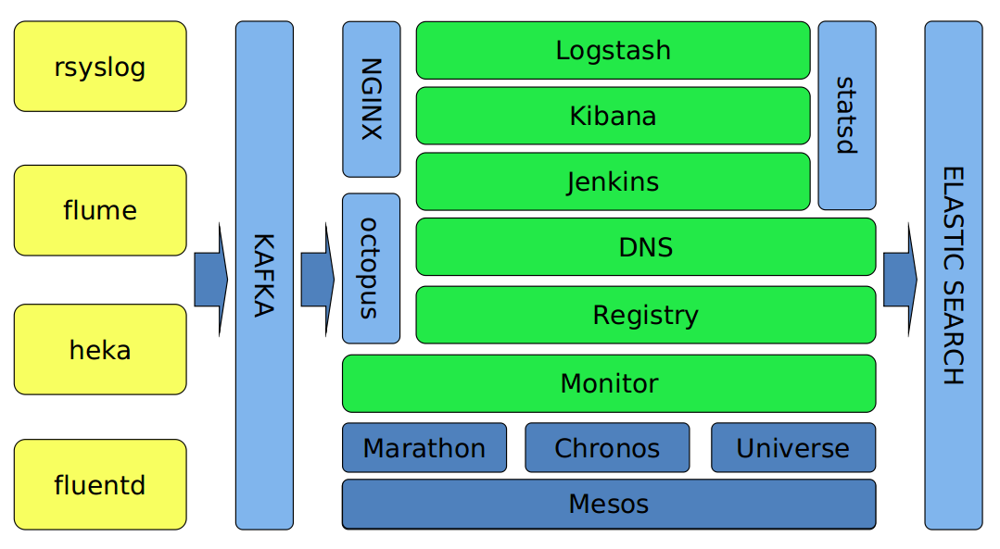
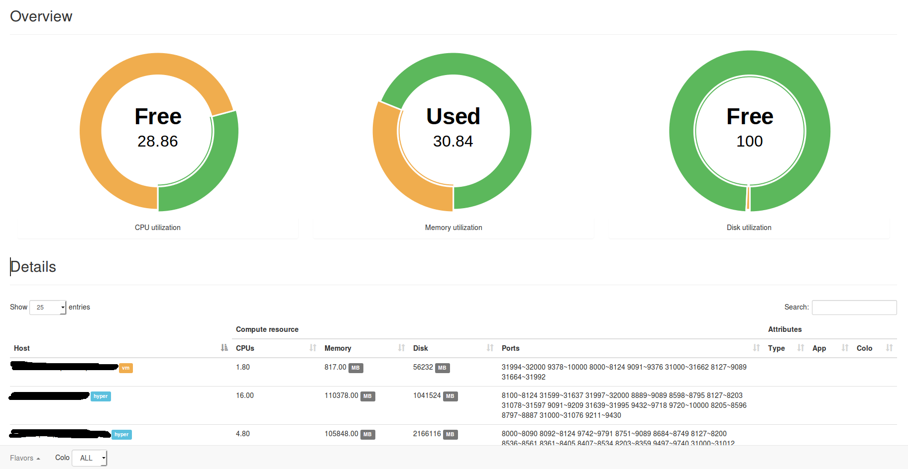
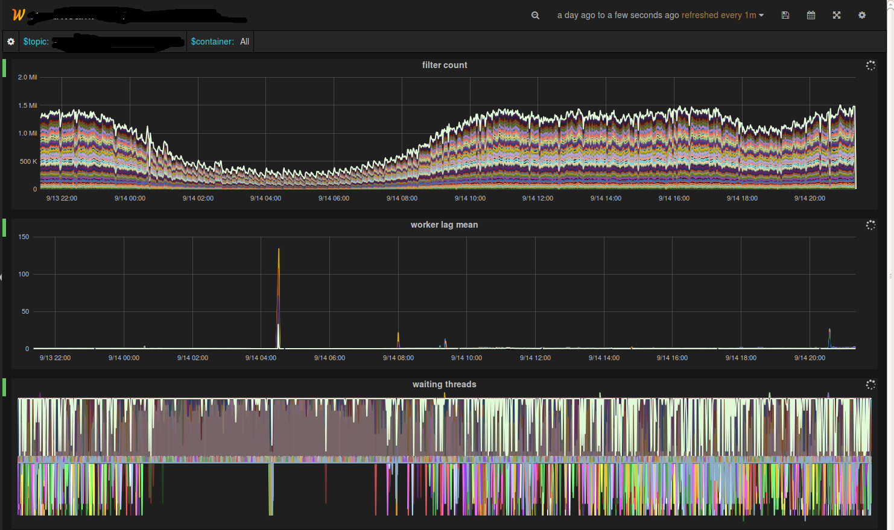
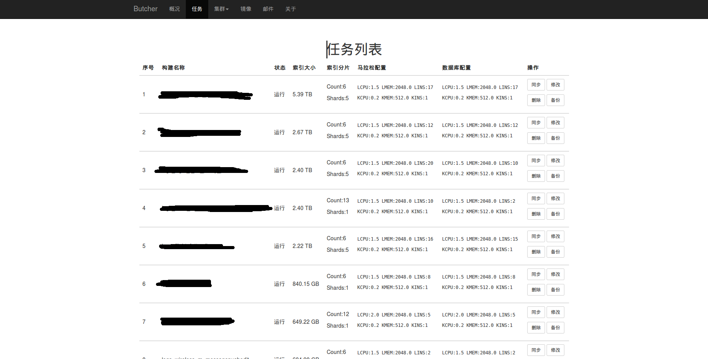

# Mesos搭建日志处理系统实战

## 平台介绍
我们是在今年的5月份开始调研并尝试使用Mesos，第一个试点就是我们的日志平台，我们将日志分析全部托管在Mesos平台上。日志平台面向业务线开发、测试、运营人员，方便定位、追溯线上问题和运营报表。

这个是我们平台的结构概览。

日志分析我们使用ELK（Elasticsearch、Logstash、Kibana），这三个应该说是目前非常常见的工具了。而且方案成熟，文档丰富，社区活跃（以上几点可以作为开源选型的重要参考点）。稍微定制了下Kibana和Logstash，主要是为了接入公司的监控和认证体系。

日志的入口有很多，如kernel、mail、cron、dmesg等日志通过rsyslog收集。业务日志通过flume收集，容器日志则使用mozilla的heka和fluentd收集。

这里稍稍给heka和fluentd打个广告，两者配合收集Mesos平台内的容器日志非常方便，可以直接利用MESOS_TASK_ID区分容器（此环境变量由Mesos启动容器时注入）。而且我们也有打算用heka替换logstash。

## Mesos技术栈

下面主要分享一下Mesos这块，我们使用了两个框架：Marathon和Chronos，另外自己开发了一个监控框架Universe。

先说Marathon，eventSubscriptions是个好功能，通过它的httpcallback可以有很多玩法，群里经常提到的bamboo就是利用这个功能做的。利用好这个功能，做容器监控就非常简单了。

接着是Marathon的重启（更新），推荐设置一下minimumHealthCapacity，这样可以减少重启（更新）时的资源占用，防止同时启动多个运行实例时消耗过多集群资源。

服务发现，Marathon提供了servicerouter.py导出haproxy配置，或者是bamboo，但是我们现在没有使用这两个。而是按协议分成了两部分，HTTP协议的服务是使用OpenResty开发了一个插件，动态加载Marathon（Mesos）内的应用信息，外部访问的时候proxy_pass到Mesos集群内的一个应用，支持upstream的配置。

非HTTP的应用，比如集群内部的statsd的UDP消息，我们就直接用Mesos DNS + 固定端口来做了。随即端口的应用依赖entrypoint拉取域名+端口动态替换。

带有UNIQUE attribute的应用，官方目前还无法做到自动扩容，从我们的使用情况来看，基于UNIQUE方式发布的应用全部是基础服务，比如statsd、heka（收集本机的Docker日志）、cAdvisor（监控容器）等，集群新加机器的时候Marathon不会自动scale UNIQUE实例的数量，这块功能社区正在考虑加进去。我们自己写了一个daemon，专门用来监控UNIQUE的服务，发现有新机器就自动scale，省的自己上去点了。

另外一个问题，资源碎片化，Marathon只是个框架，关注点也不在这里。Mesos的UI里虽然有统计，但是很难反应真实的情况，于是我们就自己写了一个Mesos的框架，专门来计算资源碎片和真实的余量，模拟发布情况，这样我们发布新应用或者扩容的时候，就知道集群内真实的资源余量能否支持本次发布，这些数据会抄送一份给我们的监控/报警系统。Chronos我们主要是跑一些定时清理和监控的脚本。

Docker这块，我们没有做什么改动，网络都使用host模式。Docker的监控和日志上面也提到了，我们用的是cAdvisor和heka，很好很强大，美中不足的是cAdvisor接入我们自己的监控系统要做定制。

我们也捣鼓了一个Docker SSH Proxy，可能是我们更习惯用虚拟机的缘故吧，有时候还是喜欢进入到容器里去干点啥的（其实业务线对这个需求更强烈），就是第一张图里的octopus，模拟docker exec -it的工作原理，对接Mesos和Marathon抓取容器信息。这样开发人员在自己机器上就能SSH到容器内部debug了，也省去了申请机器账号的时间了。

## 应用方案

接着说说我们的日志平台。这个平台的日志解析部分全部跑在Mesos上，平台自身与业务线整合度比较深，对接了一些内部系统，主要是为了考虑兼容性和业务线资源复用的问题，我尽量省略与内部系统关联的部分，毕竟这块不是通用性的。

平台目前跑了有600+的容器，网络是Docker自带的host模式，每天给业务线处理51亿+日志，延时控制在60～100ms以内。

最先遇到的问题是镜像，是把镜像做成代码库，还是一个运行环境？或者更极端点，做一个通用的base image？结合Logstash、heka、statsd等应用特点后，我们发现运行环境更适合，这些应用变化最大的经常是配置文件。所以我们先剥离配置文件到GitLab，版本控制交给GitLab，镜像启动后再根据tag拉取。

另外，Logstash的监控比较少，能用的也就一个metrics filter，写Ruby代码调试不太方便。索性就直接改了Logstash源码，加了一些监控项进去，主要是监控两个Queue的状态，顺便也监控了下EPS和解析延时。

Kafka的partition lag统计跑在了Chronos上，配合我们每个机房专门用来引流的Logstash，监控业务线日志的流量变得轻松多了。

容器监控最开始是自己开发的，从Mesos的接口里获取的数据，后来发现hostname：UNIQUE的应用Mesos经常取不到数据，就转而使用cAdvisor了，对于Mesos/Marathon发布的应用，cAdvisor需要通过libcontainer读取容器的config.json文件，获取ENV列表，拿到MESOS_TASK_ID和MARATHON_APP_ID，根据这两个值做聚合后再发到statsd里（上面提到的定制思路）。

发布这块我们围绕这Jenkins做了一个串接。业务线的开发同学写filter并提交到GitLab，打tag就发布了。发布的时候会根据集群规划替换input和output，并验证配置，发布到线上。本地也提供了一个sandbox，模拟线上的环境给开发人员debug自己的filter用。

同时发布过程中我们还会做一些小动作，比如Kibana索引的自动创建，Dashboard的导入导出，尽最大可能减少业务线配置Kibana的时间。每个应用都会启动独立的Kibana实例，这样不同业务线间的ACL也省略了，简单粗暴，方便管理。没人使用的时候自动回收Kibana容器，有访问了再重新发一个。

除了ELK，我们也在尝试Storm on Mesos，感觉这个坑还挺多的，正在努力的趟坑中。扫清后再与大家一起交流。