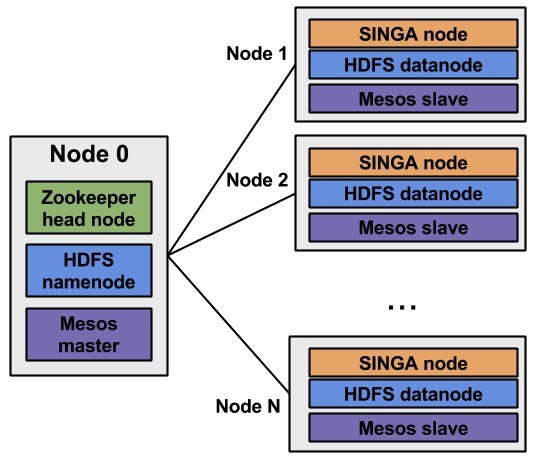
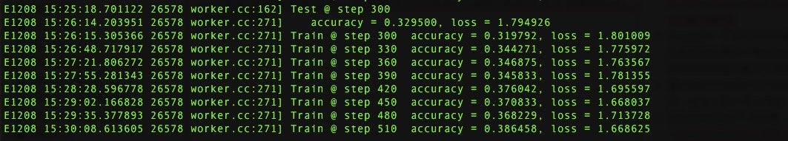

# Mesos搭建大数据平台Hadoop和深度机器学习平台Singa实战

# Mesos系统简介

Mesos是一个跨应用集群的共享资源调度和隔离的分布式集群管理系统，它可以在集群应用如：Hadoop MapReduce、Hbase、MPI等之间共享资源并保证各个应用之间的隔离。Mesos是Apache基金会的顶级项目，一经推出就饱受推崇和关注，Twitter是最早的将其应用在自己生态系统架构中的公司。在Twitter内部，Mesos被当作成了DCOS系统，几乎所有的应用服务都使用Mesos进行分布式资源调度。随后像APPLE这样的大型科技公司也将Mesos引入到自己的数据中心，随着越来越多的大型公司将Mesos作为自己数据中心的操作系统，Mesos作为DCOS的应用被广泛的讨论和应用实践。在国内也有Mesos作为DCOS的用案例，如数人云等。

## 1.1、Mesos与其他分布式调度系统的对比

### 1.1.1 Mesos VS Kubernetes

关于Mesos在前面一小节已经根据官方的定义进行了说明，那么关于Kubernetes官方的定义是这样的：Kubernetes is an open source orchestration system for Docker containers.\(Kubernetes是一个开源的Docker容器调度编排系统。）  
 换句话说，Kubernetes是一个Docker容器的高级管理系统，可以从集群应用层面出发满足对应用进行集群化部署、管理的需求。下图可以很形象的说明这种特性：

  
             （图片来自Kuberbetes官网）

关于Mesos和Kubernetes的区别，我准备这样表述：Mesos更偏重于对应用资源的分布式调度和管理，它只负责资源的均衡分布式调度，至于资源的使用是由各种框架来实现的。而Kubernetes更偏重于提供一个基于Docker容器的轻量级应用集群部署平台，它着重于如何更有效的帮助开发运维人员实现一个应用的分布式集群部署。

对于到底是Mesos更有前景还是Kubernetes能够取代Mesos这里不做争论，我认为这两个项目都是非常优秀的开源项目，在不同的应用场景下具备各自不同的优势，如对于一些非分布式任务型的应用（如一些移动APP），这些应用更多的通过分布式集群部署实现服务的负载均衡和弹性伸缩以及快速迭代部署，那么这种情况下我认为面向应用且被各大软将厂商支持的Kubernetes更有优势；而对于一些分布式任务型的应用（如Hadoop、spark等），这些应用是通过分布式集群资源调度系统实现计算资源的逻辑上一致性，进而实现任务的并行计算等功能，那么这种情况下我认为面向底层资源并采用双层调度机制的Mesos更具优势。

### 1.1.2 Mesos VS Yarn

对于YARN的介绍在百度百科是这样描述的：YARN （Yet Another Resource Negotiator，另一种资源协调者）是一种新的 Hadoop 资源管理器，它是一个通用资源管理系统，可为上层应用提供统一的资源管理和调度，它的引入为集群在利用率、资源统一管理和数据共享等方面带来了巨大好处。

Mesos和Yarn都采用了双层调度机制，这种机制很好的解决了集中式资源调度机制在资源集群调度过程中扩展性差、兼容性不好的问题。Mesos和Yarn都是面向底层资源调度的分布式集群系统，其应用场景基本是类似的（Hadoop、spark等），但是由于Yarn是从Hadoop1.0发展出来的，所以在Hadoop体系的项目以及基于这些项目的应用对Yarn都有比较好的兼容性和丰富的应用实践。  
关于Mesos与Yarn的对比，每个我只从一个优势方面阐述一下。Mesos相对与Yarn的优势之一是它的二层调度机制更开放，在第一层对资源的调度颗粒度更大，这样的好处是给予第二层调度机制的资源管理权限更大，对计算框架的限制更少，这是因为Mesos的二层调度机制是基于Resoure Officer的，而Yarn是基于solt的。Yarn相对对于Mesos的优势之一是其具备成熟的生态圈，特别是在Hadoop系统中，各个子项目都有基于Yarn的成熟应用实践和丰富的生态群应用。

## 1.3 搭建环境简介

本次搭建的环境以及下一节的Mesos集群的部署都是参考我之前在Dockerone上写的一篇文章，因为这个环境是现成的且结构比较全（3个maste节点和3个slave节点\)，而且那篇部署教程在写完之后我自己还进行过重新部署，是写的比较全面且坑比较少的部署教程。以下是部署环境的简介：  
  

如图所示其中master节点都需要运行ZooKeeper、Mesos-master、Marathon，在slave节点上只需要运行master-slave就可以了，但是需要修改ZooKeeper的内容来保证slave能够被master发现和管理。为了节约时间和搞错掉，我在公司内部云平台上开一个虚拟机把所有的软件都安装上去，做成快照进行批量的创建，这样只需要在slave节点上关闭ZooKeeper、Mesos-master服务器就可以了，在文中我是通过制定系统启动规则来实现的。希望我交代清楚了，现在开始部署。

## 1.4 Mesos集群部署

### 1.4.1准备部署环境

* 在Ubuntu 14.04的虚拟机上安装所有用到软件，并保证虚拟机可以上互联网。

* 安装Python依赖
* `apt-get install curl python-setuptools python-pip python-dev python-protobuf`
* 安装配置zookeeper
* \`\`\`apt-get install ZooKeeperd &
  echo 1 \| sudo dd of=/var/lib/ZooKeeper/myid\`\`\`
* 安装配置Mesos－master和Mesos-slave
* `curl-fL http://downloads.Mesosphere.io/master/ubuntu/14.04/Mesos_0.19.0~ubuntu14.04%2B1_amd64.deb -o /tmp/Mesos.deb`
* `dpkg -i /tmp/Mesos.deb`
* `mkdir -p /etc/Mesos-master`
* `echo in_memory | sudo dd of=/etc/Mesos-master/registry`
* 安装配置Mesos的Python框架
* `curl -fL http://downloads.Mesosphere.io/master/ubuntu/14.04/Mesos-0.19.0_rc2-py2.7-linux-x86_64.egg -o /tmp/Mesos.egg`
* `easy_install /tmp/Mesos.egg`
* 下载安装Mesos管理Docker的代理组件Deimos
* `pip install deimos`
* 配置Mesos使用Deimos
* `mkdir -p /etc/mesos-slave`
* `echo /usr/local/bin/deimos | sudo dd of=/etc/Mesos-slave/containerizer_path`
* `echo external | sudo dd of=/etc/Mesos-slave/isolation`
* 安装Docker
* `echo deb http://get.Docker.io/ubuntu Docker main | sudo tee /etc/apt/sources.list.d/Docker.list`
* `sudo apt-key adv --keyserver keyserver.ubuntu.com --recv-keys 36A1D7869245C8950F966E92D8576A8BA88D21E9`
* `apt-get update && apt-get install lxc-Docker`
  至此在一个虚拟机上就完成了所有组件的安装部署，下面就是对虚拟机打快照，然后快速的复制出6个一样的虚拟机，按照上图的ip配置进行配置之后就可以进入下个阶段，当然为了保险你可以测试一下上处组件是否安装成功和配置正确。如果你没有使用云平台，或者不具备快照功能，那就只能在6个虚拟机上重复6遍上处过程了。

### 1.4.2、在所有的节点上配置ZooKeeper

在配置maser节点和slave节点之前，需要先在所有的6个节点上配置一下ZooKeeper，配置步骤如下：

* 修改zk的内容
* `sudo vi /etc/Mesos/zk`
* 将zk的内容修改为如下：
* `zk://10.162.2.91:2181,10.162.2.92:2181,10.162.2.93:2181/Mesos`

### 1.4.3配置集群中的三个master节点

在所有的master节点上都要进行如下操作：

* 修改ZooKeeper的myid的内容
* `sudo vi /etc/zooKeeper/conf/myid`
* 将三个master节点的myid按照顺序修改为1，2，3。
* 修改ZooKeeper的zoo.cfg
* `sudo vi/etc/zooKeeper/conf/zoo.cfg`
* 配置内容如下：
* `server.1=10.162.2.91:2888:3888`
* `server.2=10.162.2.92:2888:3888`
* `server.3=10.162.2.93:2888:3888`
* 修改Mesos的quorum
* `sudo vi /etc/mesos-master/quorum`
* 将值修改为2。
* 配置master节点的Mesos 识别ip和和hostname\(以在master1上的配置为例）
* `echo 10.162.2.91 | sudo tee /etc/mesos-master/ip`
* `sudo cp /etc/mesos-master/ip /etc/mesos-master/hostname`
* 配置master节点服务启动规则（重启不启动slave服务）
* \`\`\`sudo stop Mesos-slave
  echo manual \| sudo tee /etc/init/Mesos-slave.override\`\`\`

### 1.4.4、配置集群中的的slave节点

* 配置slave节点的服务启动规则（重启不启动zookeeper和slave服务）
* `sudo stop zooKeeper`
* `echo manual | sudo tee /etc/init/zooKeeper.override`
* `echo manual | sudo tee /etc/init/mesos-master.override`
* `sudo stop mesos-master`
* 配置slave节点的识别ip和hostname（以slave1节点为例）
* `echo 192.168.2.94 | sudo tee /etc/mesos-slave/ip`
* `sudo cp /etc/Mesos-slave/ip /etc/mesos-slave/hostname`

### 1.4.5、在集群的所有节点上启动相应的服务

* 启动master节点的服务（zookeeper和mesos-master服务）
* `initctl reload-configuration`
* `service zookeeper start`
* `service mesos-master start`
* 启动slave节点上的相应服务（mesos-slave服务）
* `sudo start mesos-slave`

### 1.4.5、Troubleshooting

由于有的网络情况和设备情况不一样，所以选举的过程有的快有的慢，但刷新几次就可以完成选举。当发现slave节点有些正常有些不正常时，可以通过reboot来促使自己被master发现。

## 1.5、Hadoop在Mesos集群上部署

### 1.5.1、部署前准备

* 在部署和HDFS初始化过程中都需要跨节点的操作和SSH，因此首先在Mesos集群的所有节点上关闭防火墙。如下：
* `chkconfig iptables off`（在root用户下操作）
* 关闭selinux
* `setenforce 0`\(在root用户下操作）
* 在HDFS部署中，或者说在分布式架构的部署过程中节点之间的通信都是以主机名为地址标识，因此要保证每个节点主机名的唯一。
* 在Master1节点上配置hostname:
* `vi /etc/hostname`
* `master1`
* 在Masrer1节点上配置hosts
* `vi /etc/hosts`
* `127.0.0.1 localhost`
* `10.162.2.91 master1`
* `10.162.2.92 master2`
* `10.162.2.93 master3`
* `10.162.2.94 slave1`
* `10.162.2.95 slave2`
* `10.162.2.96 slave3`
* 在其他节点上都参照上述配置进行修改hostname和hosts.
* 在部署HDFS和Hadoop时，需要使用非root用户来进行操作，虽然大部分情况下也可以在root用户下操作，但以往的经验是非root用户下操作部署更顺畅。
* 添加新的用户
* `addusr hadoop`
* 重置hadoop用户的密码
  \*`passwd hadoop`

### 1.5.2、在Mesos集群中部署HDFS

* 本次案例的集群中master有三个节点，slave有三个节点，在master节点中使用zookeeper进行服务选举，在部署HDFS时也会用到zookeeper进行namenode节点的选举。

### 在master节点上部署namenode

* 创建一个文件目录用于
* `mkdir -p /mnt/cloudera-hdfs/1/dfs/nn /nfsmount/dfs/nn`
* 修改文件目录的用户权限，给上一步创建的文件目录添加用户hadoop操作权限
* `chown -R hadoop:hadoop /mnt/cloudera-hdfs/1/dfs/nn /nfsmount/dfs/nn`
* 修改文件目录的操作权限
* `chmod 700 /mnt/cloudera-hdfs/1/dfs/nn /nfsmount/dfs/nn`
* 使用apt-get 安装hadoop-hdfs-namenode,这样可以避免使用二进制文件在编译过程中遇到的坑。
* `wget http://archive.cloudera.com/cdh5/one-click-install/precise/amd64/cdh5-repository_1.0_all.deb`
* `sudo dpkg -i cdh5-repository_1.0_all.deb`
* `sudo apt-get update; sudo apt-get install hadoop-hdfs-namenode`
  \*`cp /etc/hadoop/conf.empty/log4j.properties/etc/hadoop/conf.name/log4j.properties`

### 1.5.3、在slave节点上部署datanode

* 创建挂载目录
* `mkdir -p /mnt/cloudera-hdfs/1/dfs/dn /mnt/cloudera-hdfs/2/dfs/dn /mnt/cloudera-hdfs/3/dfs/dn /mnt/cloudera-hdfs/4/dfs/dn`
* 修改挂在目录所属的用户组
* `chown -R hadoop:hadoop /mnt/cloudera-hdfs/1/dfs/dn/mnt/cloudera-hdfs/2/dfs/dn /mnt/cloudera-hdfs/3/dfs/dn /mnt/cloudera-hdfs/4/dfs/dn`
* 使用apt-get 安装hadoop-hdfs-datanode
* `wget http://archive.cloudera.com/cdh5/one-click-install/precise/amd64/cdh5-repository_1.0_all.deb`
* `dpkg -i cdh5-repository_1.0_all.deb`
* `sudo apt-get update; sudo apt-get install hadoop-hdfs-datanode`
* `sudo apt-get install hadoop-client`

### 1.5.4、 格式化并启动namenode节点

* `sudo -u hadoop hadoop namenode -format`
* `service hadoop-hdfs-namenode start`

### 1.5.5、启动slave节点

* `service hadoop-hdfs-datanode start`

### 1.5.6 配置服务自启动

* 在namenode节点上
* `update-rc.d hadoop-hdfs-namenode defaults`
* `update-rc.d zookeeper-server defaults`
  \*在slave节点上
* `update-rc.d hadoop-hdfs-datanode defaults`

## 1.6、在Mesos集群中部署Hadoop

### 1.6.1、Hadoop的基本安装

* 下载Hadoop安装文件包
* `wget http://archive.cloudera.com/cdh5/cdh/5/hadoop-2.3.0-cdh5.1.2.tar.gz`
* 将安装文件包解压缩
* `tar zxf hadoop-2.3.0-cdh5.1.2.tar.gz`
* 下载hadooponmesos二进制文件
* `git clone https://github.com/mesos/hadoop.git hadoopOnMesos`
* 使用mvn编译hadooponmesos文件
* `mvn package`
* 注意：mvn package要在下载的hadoopOnMesos文件夹中执行,编译好后可以在target文件夹中找到一个编译好的jar文件。

* 将编译好的jar文件拷贝到hadoo-hdfs安装文件夹和下载的hadoop安装文件夹中

* `cp hadoopOnMesos/target/hadoop-mesos-0.1.0.jar /usr/lib/hadoop-0.20-mapreduce/lib/`
* `cp hadoopOnMesos/target/hadoop-mesos-0.1.0.jar hadoop-2.3.0-cdh5.1.2/share/hadoop/common/lib/`
* 配置CDH5使用MRv1，因为在MRv2中hadoop的任务调度是使用yarn的
* `cd hadoop-2.3.0-cdh5.1.2`
* `mv bin bin-mapreduce2`
* `mv examples examples-mapreduce2`
* `ln -s bin-mapreduce1 bin`
* `ln -s examples-mapreduce1 examples`
* `pushd etc`
* `mv hadoop hadoop-mapreduce2`
* `ln -s hadoop-mapreduce1 hadoop`
* `popd`
* `pushd share/hadoop`
* `rm mapreduce`
* `ln -s mapreduce1 mapreduce`
* `popd`
* 配置Hadoop运行所需的环境和配置文件：
* `cp target/hadoop-mesos-0.1.0.jar /usr/lib/hadoop-0.20-mapreduce/lib`
* \*/上一步是将hadoopOnmesos编译好的jar包放到hadoop调用库文件夹中，以便hadoop可以使用mesos调度资源运行job任务。
* `vim /etc/profile.d/hadoop.sh`
* `export HADOOP_MAPRED_HOME=/usr/lib/hadoop-0.20-mapreduce`
* `export MESOS_NATIVE_JAVA_LIBRARY=/usr/local/lib/libmesos.so`
* \*/上一步是在hadoop的运行脚本中配置HOME路径和Mesos的原生库。
* `chmod +x /etc/profile.d/hadoop.sh`
* `/etc/profile.d/hadoop.sh`
* `cd ..`
* `rm hadoop-2.3.0-cdh5.1.2-mesos-0.20.tar.gz`
* \*/删除下载的cdh5原始文件
* `tar czf hadoop-2.3.0-cdh5.1.2-mesos-0.20.tar.gz hadoop-2.3.0-cdh5.1.2/`
* \*/上一步是将配置好的hadoop安装文件重新打包
* `hadoop dfs -put hadoop-2.3.0-cdh5.1.2-mesos-0.20.tar.gz /`
* \*/上一步是将打包好的hadoop安装包上传到hdfs上

### 1.6.2、 Hadoop配置文件配置

* 配置mapred-site.xml
* `vi /etc/hadoop/conf.cluster-name/mapred-site.xml`
* mapred-site.xml需要配置文件内容
* `<name>mapred.jobtracker.taskScheduler</name>`
* `<value>org.apache.hadoop.mapred.MesosScheduler</value>`
* \*/上一步是通过配置mapred的jobtrackerd.taskSchedule来告诉Hadoop使用Mesos来调度管理任务。
* `<name>mapred.mesos.taskScheduler</name>`
* `<value>org.apache.hadoop.mapred.JobQueueTaskScheduler</value>`
* `<name>mapred.mesos.master</name>`
* `<value>zk:10.162.2.91:2181，10.162.2.92:2181，10.162.2.93:2181/mesos</value>`
* \*/上一步配置是保证mapred能够准确的找到mesos master节点通过zookeeper选举出来的的主节点。
* `<name>mapred.mesos.executor.uri</name>`
* `<value>hdfs:/10.162.2.92:9000/hadoop-2.3.0-cdh5.1.2-mesos.0.20.tar.gz</value>`
* \*/上一步是配置hadoop的路径，这样mapred可以知道到那里调用hadoop代码执行task，这里10.162.2.92是本地主机的IP地址，在10.162.2.91主机上时就改成10.162.2.91.
* `<name>mapred.job.tracker</name>`
* `<value>10.162.2.92:9001</value>`
* \*/上一步是配置jobtracker的主机IP地址，和上一步一样这要配置本机的IP地址
* 配置本地的Mesos原生库
* `vim /usr/lib/hadoop-0.20-mapreduce/bin/hadoop-daemon.sh`
* `export MESOS_NATIVE_JAVA_LIBRARY=/usr/local/lib/libmesos.so`
  \*完成上述配置后尝试启动jobtracker，验证是否安装部署成功。
* `service hadoop-0.20-mapreduce-jobtracker start`
* 可以通过jps查看jobtracker进程是否在运行
* `jps`

### 1.6.3、 在其他namenode和datanode上完成部署

* 在其他两个Master节点上完成相应的配置
* 将之前重新打包好的hadoop-2.3.0-cdh5.1.2-mesos-0.20.tar.gz发送到三个datanode节点上
* `scp -r hadoop-2.3.0-cdh5.1.2-mesos-0.20.tar.gz hadoop@10.162.2.94:/hadoop`
* `scp -r hadoop-2.3.0-cdh5.1.2-mesos-0.20.tar.gz hadoop@10.162.2.95:/hadoop`
* `scp -r hadoop-2.3.0-cdh5.1.2-mesos-0.20.tar.gz hadoop@10.162.2.96:/hadoop`
  \*重启HDFS的nomenode和datanode

## 1.7 Troubleshoting

注意：在每次重启HDFS服务的时候，需要先确保Mesos集群是正常运行的。namenode重启的时候可以先重新format一下。

## 1.8、基于Mesos搭建深度机器学习平台Singa

### 1.8.1、 Singa项目简介

Singa是由NUS、浙江大学、网易联合进行开发并开源的一个深度机器学习平台，其设计目的是为多种深度学习模型（如CNN、DBN\)提供一个有效的、易用的、高扩展的分布式实现平台。在Singa平台上，用户可以像在Hadoop上实现Map/Reducer一样轻易的训练他们所需要的抽象的深度学习模型。Singa的详细信息可以访问[https://wiki.apache.org/incubator/SingaProposal。](https://wiki.apache.org/incubator/SingaProposal。)

### 1.8.2、 Singa on mesos部署架构

Singa在设计其底层的资源调度系统时选择了Mesos这一优秀的分布式集群资源调度系统，如下图所示：

  
（图片来自[https://github.com/apache/incubator-singa/tree/master/tool/mesos）](https://github.com/apache/incubator-singa/tree/master/tool/mesos）)

如上图所示，在统一分布式存储层面使用了HDFS，这样有利于整个singa在运行过程中提高文件的读写效率，在分布式资源调度层面使用mesos进行统一的资源调度。

### 1.8.3、 Singa on mesos部署过程

本次部署的过程是在ubuntu14.04上ubuntu用户下完成部署的。

* 更换/bin/sh为/bin/bash
* `rm /bin/sh && ln -s /bin/bash /bin/sh`
* 更新源，这里使用的是网易的源
* `vi /etc/apt/sources.list`
* `deb http://mirrors.163.com/ubuntu/ trusty main restricted universe multiverse  
  deb http://mirrors.163.com/ubuntu/ trusty-security main restricted universe multiverse  
  deb http://mirrors.163.com/ubuntu/ trusty-updates main restricted universe multiverse  
  deb http://mirrors.163.com/ubuntu/ trusty-proposed main restricted universe multiverse  
  deb http://mirrors.163.com/ubuntu/ trusty-backports main restricted universe multiverse  
  deb-src http://mirrors.163.com/ubuntu/ trusty main restricted universe multiverse  
  deb-src http://mirrors.163.com/ubuntu/ trusty-security main restricted universe multiverse  
  deb-src http://mirrors.163.com/ubuntu/ trusty-updates main restricted universe multiverse  
  deb-src http://mirrors.163.com/ubuntu/ trusty-proposed main restricted universe multiverse  
  deb-src http://mirrors.163.com/ubuntu/ trusty-backports main restricted universe multiverse`

* 安装各种依赖，这些依赖有的已经系统自带了，但为了保证没有遗漏可以都执行一遍

* `apt-get update && apt-get -y install g++-4.8 build-essential git vim wget zip`
* `apt-get install automake libtool man python-dev python-boto libcurl4-nss-dev`
* `apt-get install libsasl2-dev maven libapr1-dev libsvn-dev openssh-server supervisor`
* 下载安装jdk
* `cd /opt && wget --no-check-certificate --no-cookies --header "Cookie: oraclelicense=accept-securebackup-cookie"  http://download.oracle.com/otn-pub/java/jdk/8u60-b27/jdk-8u60-linux-x64.tar.gz && cd /opt && tar -zxvf jdk-8u60-linux-x64.tar.gz && rm -rf jdk-8u60-linux-x64.tar.gz`
* 下载singa安装文件
* `git clone https://github.com/apache/incubator-singa.git`
* 更新ssh.conf .bashrc  .vimr
* `cd incubator-singa/tool/docker/singa/`
* `cp ssh.conf /etc/supervisor/conf.d/`
* `cp .bashrc /root/.bashrc`
* `cp .vimrc /root/.vimrc`
* 使刚才更新的源生效
* `source /root/.bashrc`
* 下载和安装第三方应用
* `cd incubator-singa && ./thirdparty/install.sh all`
* 下载并解压protobuf
* `cd thirdparty/ && wget https://github.com/google/protobuf/releases/download/v2.5.0/protobuf-2.5.0.tar.gz && tar -zxvf protobuf-2.5.0.tar.gz`
* 编译并安装protobuf
* `cd protobuf-2.5.0 && ./configure && make && make install`
* 安装zookeeper
* `cd ../../ && cp thirdparty/install.sh . && rm -rf thirdparty/* && mv install.sh thirdparty/ && ./thirdparty/install.sh zookeeper && ./autogen.sh && ./configure && make && make install`
* 下载一个机器学习CNN的运行实例
* `cd examples/cifar10 && mv Makefile.example Makefile && make download && make create`
* 启动ssh服务
* `service ssh start`
* 更新.bashrc
* `cd incubator-singa/tool/docker/mesos/`
* `cp .bashrc /root/.bashrc`
* 使用自动安装脚本进行安装
* `install.sh /opt/install.sh`
* `cd /opt && source ./install.sh`
* 安装各种依赖软件
* `apt-get -y install curl cmake libxml2 libxml2-dev uuid-dev protobuf-compiler libprotobuf-dev libgsasl7-dev libkrb5-dev libboost1.54-all-dev`
* 下载安装hadoop-2.6
* `cd /opt && source /root/.bashrc && wget -c http://www.eu.apache.org/dist/hadoop/common/hadoop-2.6.0/hadoop-2.6.0.tar.gz && tar -zxvf hadoop-2.6.0.tar.gz && git clone https://github.com/PivotalRD/libhdfs3.git && cd libhdfs3 && mkdir build && cd build && cmake ../ && make && make instal`
* 编译安装mesos
* `source ~/.bashrc && cd /root/incubator-singa/tool/mesos && make`
* 将hadoop的配置文件放到hadoop的安装目录下
* `cd/incubator-singa/tool/docker/mesos`
* `cp *.xml /opt/hadoop-2.6.0/etc/hadoop/`
* 和hadoop的部署一样需要配置免认证登录
* `ssh-keygen -t dsa -P '' -f ~/.ssh/id_dsa && cat ~/.ssh/id_dsa.pub >> ~/.ssh/authorized_keys && echo 'StrictHostKeyChecking no' >> ~/.ssh/config`
* 至此在单一节点的安装部署已经完成，在安装过程中使用了大量的自动化脚本和依赖软件集体安装，所以这一过程要确保网络环境良好，如果发现报错或者下载不了则需要重新的下载和安装。
* 通过虚拟化快照的方式迅速扩展到多个节点，并依次启动各节点的服务，本次以两个节点为例，包含了master\(namenode\)和slave\(datanode\)
* 修改Hadoop的节点配置，增加datanode节点
* `cd/opt/hadoop-2.6.0/etc/hadoop`
* `vi slaves`
* 修改各个节点的hosts，增加namenode和datanode
  `vi /etc/hosts`
* 在master节点上启动master
  `mesos-master`
* 在slave节点启动slave
* `mesos-slave --master=10.10.245.23`
* 在master节点上启动hdfs
* `hadoop namonode`
* 启动一个训练示例，开始使用signa进行训练
* \`\`\`$ cd ../../
  $ ./bin/zk-service.sh start
  $ ./bin/singa-run.sh -conf examples/cifar10/job.conf\`\`\`

运行结果如下：  

以上就是简单的部署过程，如果要深入的研究singa的使用可以关注NUS的signa开源项目。

