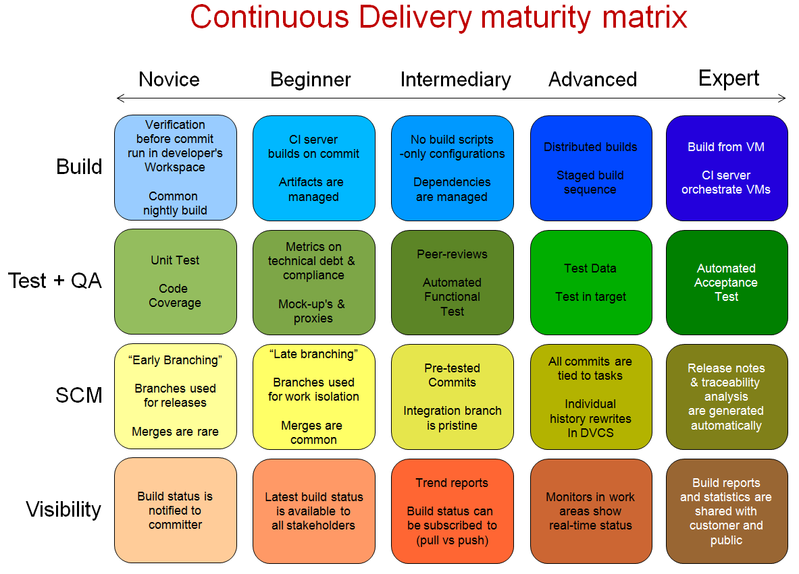

# 7.2 持续集成简介

大师 Martin Fowler 对持续集成是这样定义的:持续集成是一种软件开发实践，即团队开发成员经常集成他们的工作，通常每个成员每天至少集成一次，也就意味着每天可能会发生多次集成。每次集成都通过自动化的构建（包括编译，发布，自动化测试)来验证，从而尽快地发现集成错误。许多团队发现这个过程可以大大减少集成的问题，让团队能够更快的开发内聚的软件。

本章主要结合实践经验介绍持续集成的价值，涉及到的主要工具以及持续集成的大致流程等。

## 7.2.1 持续集成能为团队带来什么

我们一致认为，持续集成至少可以为团队带来下述几点[价值](http://baike.baidu.com/link?url=YUuGXCCgfPK9Z_Yf728mCkL7ccEAxEBGVOOrQETCTP_w7R-N3qtqS7Hd4ZV6XibkC5YxuFw1HfLW90dL8B0KKa)：

- 有效的控制或降低风险
> 软件一天中进行多次的集成，并触发了相应的测试，这样有利于检查缺陷，了解软件的健康状况，减少假定，从而有效的控制或降低了风险。
- 提高团队效率
> 减少重复的过程可以节省团队的时间、费用和工作量。在软件开发过程中，浪费时间的重复劳动可能在我们的项目活动的任何一个环节发生，包括代码编译、数据库集成、测试、审查、部署及反馈。通过持续集成可以将这些重复的动作都变成自动化的，无需太多人工干预，让团队成员将时间更多的投入到动脑筋的、更高价值的事情上。
- 提高软件交付速度
> 持续集成可以让团队在任何时间发布可以部署的软件。从外界来看，这是持续集成最明显的好处，我们可以对改进软件品质和减少风险说起来滔滔不绝，但对于客户来说，可以部署的软件产品是最实际的资产。利用持续集成，团队任何成员都可以经常对源代码进行一些小改动，并将这些改动和其他的代码进行集成。如果出现问题，项目成员马上就会被通知到，问题会第一时间被修复。不采用持续集成的情况下，这些问题有可能到交付前的集成测试的时候才发现，有可能会导致延迟发布产品，而在急于修复这些缺陷的时候又有可能引入新的缺陷，最终可能导致项目失败。
- 提高客户及团队对项目的把控能力
> 持续集成让客户及团队能够注意到趋势并进行有效的决策。如果没有真实或最新的数据提供支持，项目就会遇到麻烦，每个人都会提出他最好的猜测。通常，项目成员通过手工收集这些信息，增加了负担，也很耗时。持续集成可以带来两点积极效果：
  - 有效决策：持续集成系统为项目构建状态和品质指标提供了及时的信息，有些持续集成系统可以报告功能完成度和缺陷率。
  - 注意到趋势：由于经常集成，我们可以看到一些趋势，如构建成功或失败、总体品质以及其它的项目信息。
- 建立团队对开发产品的信心
> 持续集成可以建立开发团队对开发产品的信心，因为他们清楚的知道每一次构建的结果，他们知道他们对软件的改动造成了哪些影响，结果怎么样。

## 7.2.2 持续集成涉及到的主要工具

* 版本控制/配置管理工具
> 版本控制与配置管理工具主要负责源代码，配置文件的管理。常见的工具如 git，svn 等， 其中 git 是当下最流行的版本控制工具。

* 构建工具
> 实现主要负责自动化地编译、测试、部署等，这是持续集成的核心工具；构建工具是编程语言依赖型的，不同编程语言使用不同的构建工具。

* CI 服务器
> CI 服务器主要负责将版本控制仓库和构建工具有机整合起来，并通过设置一种或多种构建触发条件来触发构建。常见的CI工具有
>> * [jenkins](http://jenkins-ci.org/)
>> * [travis](https://travis-ci.com/)
>> * [codeship](https://codeship.com/)
>> * [stridercd]( http://stridercd.com)

## 7.2.3 持续集成的流程

关于CI的流程，首先我们需要明确的是，基于不同的项目规模，不同的项目阶段，不同的团队大小以及不同的团队经验，CI 的流程是相应调整的。CI 流程本身也是一个逐步迭代，逐步完善的过程。

下面列出的是一个基本的，泛化的持续集成过程：

* 团队开发人员频繁的从源代码仓库下载同步代码
* 团队开发编写代码、测试用例，并提交更新结果给版本控制仓库
* CI服务器根据触发条件，从版本控制仓库提取最新代码，交给构建工具的工作空间
* 构建工具对代码进行编译、测试，并进行打包。
* 通过构建工具与版本控制工具的配合，实现产品版本控制与管理
* 建立、管理项目开发的工作网站

另外下面的图片(图7-2-1)是我在[atlassian wiki](https://chrisshayan.atlassian.net/wiki/display/my/2013/07/23/Continuous+Delivery+Matrix)下载的持续交付成熟度矩阵。这里我们不需要要考虑持续集成与持续交付的差别，或者说，在本文中，持续集成与持续交付是一样的。

 &#8195;&#8195;&#8195;&#8195;&#8195;&#8195;&#8195;&#8195;&#8195;&#8195;&#8195;&#8195;&#8195;&#8195;图7-2-1  持续交付成熟度矩阵
 
通过这张图片我们可以看出，CI流程的演进过程，从初期的 nightly build 到最终的 镜像交付； 从 merges are rare 到自动生成 ReleaseNote；从简单的将构建结果通知 committer 到向客户分享构建报告与统计结果，等等。我们可以发现，一个成熟的继续交付系统可以极大的提高生产率。