# 7.4 持续集成系统搭建

## 7.4.1 如何配置保证 Jenkins 的资源弹性，以及 Jenkins Master 的高可用

### 环境设置

  为了便于理解，这里我简化了 Mesos/Marathon 集群的架构，不再考虑集群本身的高可用性。至于如何利用 zookeeper 配置高可用的 mesos/marathon 集群，可以参考[Mesosphere的官方文档](https://mesos.apache.org/documentation/latest/mesos-architecture/)，这里不再展开。

  我搭建了一个包含40个节点 ``192.168.3.4-192.168.3.43`` 的 Mesos 集群，其中一个节点用作运行 Marthon 及 Mesos-master，其它39个节点作为 mesos 的 slave，如下所示。

    192.168.3.4  marathon/mesos-master
    192.168.3.5  mesos-slave
    192.168.3.6  mesos-slave
    ......
    192.168.3.43  mesos-slave

参照[http://get.dataman.io](http://get.dataman.io)的文档配置启动 Marathon，Mesos-Master 和 Mesos-Slave，下面的整个操作都将在这个集群上完成。
  

### 在 Marathon 上部署 Jenkins 的 master 实例

  Marathon 支持 web 页面或者 RESTapi 两种方式发布应用，在``192.168.3.＊``内网执行下面的 bash 命令，就会通过 Marathon 的 RESTapi 在 mesos slave 上启动一个 Jenkins master 实例。
  
  ```bash
  git clone git@github.com:Dataman-Cloud/jenkins-on-mesos.git && cd jenkins-on-mesos && curl -v -X POST \
  -H 'Accept: application/json' \
  -H 'Accept-Encoding: gzip, deflate' \
  -H 'Content-Type: application/json; charset=utf-8' \
  -H 'User-Agent: HTTPie/0.8.0' \
  -d@marathon.json \
  http://192.168.3.4:8080/v2/apps
```

  *这里我在github上fork了[mesosphere的jenkins-on-mesos的repo](https://github.com/mesosphere/jenkins-on-mesos)到[DataMan-Cloud/jenkins-on-mesos](https://github.com/Dataman-Cloud/jenkins-on-mesos)，并进行了一些[改进](https://github.com/Dataman-Cloud/jenkins-on-mesos/commits?author=vitan)。*
  
  如果Jenkins master实例被成功部署，通过浏览器访问``http://192.168.3.4:8080``(**请确定你的浏览器能够访问内网，譬如可以利用设置浏览器代理等方式来搞定**)可以在running tasks列表中找到jenkins，点击进入详细信息页面，我们会看到下图(图7-4-1)：
  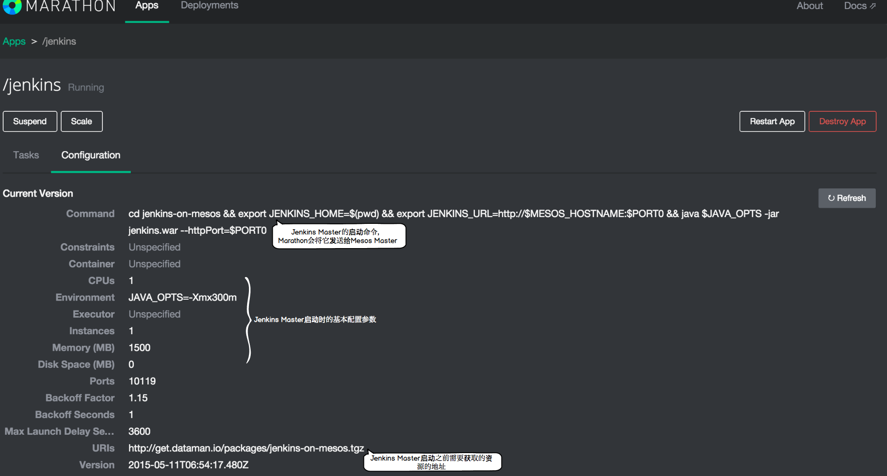
  <font size="2">&#8195;&#8195;&#8195;&#8195;&#8195;&#8195;&#8195;&#8195;&#8195;&#8195;图7-4-1  Jenkins Master 实例信息</font>
  
 访问``http://192.168.3.4:5050/#/frameworks``并在**Active Frameworks**中找到Marathon，点击进入详细信息页面，可以在该页面找到Jenkins Master具体运行到Mesos哪一台Slave上，如下图(图7-4-2)所示：
 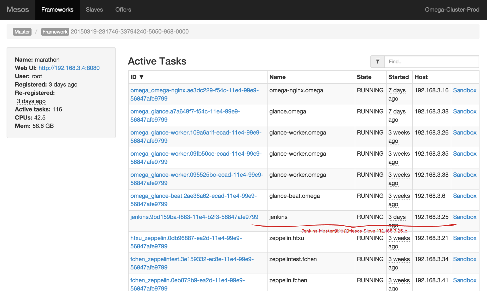
  <font size="2">&#8195;&#8195;&#8195;&#8195;&#8195;&#8195;&#8195;&#8195;&#8195;&#8195;图7-4-2  Jenkins Master  运行在 Mesos slave 上</font>

  点击sandbox(图7-4-3)
  
  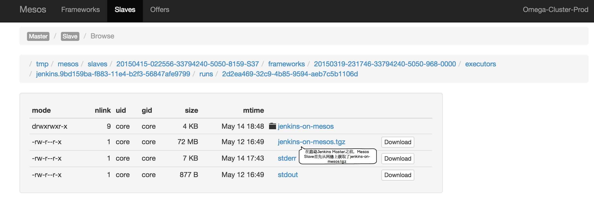
  <font size="2">&#8195;&#8195;&#8195;&#8195;&#8195;&#8195;&#8195;&#8195;&#8195;&#8195;图7-4-3  Jenkins Master 运行在 Mesos slave 上</font>

至此，我们的 Jenkins Master 已经在 marathon 上被成功启动了。

### 配置 Jenkins Master 实现弹性伸缩

接下来是配置 Jenkins 注册成为 Mesos 的 Framework，需要通过浏览器访问``http://192.168.3.25:31052/``来到 Jenkins Master 的 UI 页面。下面的截图是我逐步配置的全过程。

  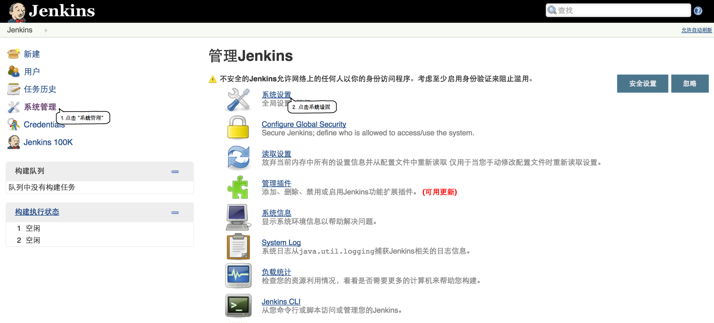
  <font size="2">&#8195;&#8195;&#8195;&#8195;&#8195;&#8195;&#8195;&#8195;&#8195;&#8195;图7-4-4 Jenkins Master 配置页面</font>

  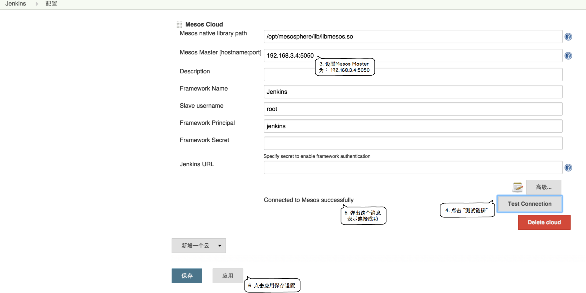
   <font size="2">&#8195;&#8195;&#8195;&#8195;&#8195;&#8195;&#8195;&#8195;&#8195;&#8195;图7-4-5  Jenkins Master 连接 Mesos 集群</font>

1. 来到 Jenins
 Master 配置页面
2. 点击系统设置
3. ``Mesos native library path`` 设置: Mesos lib 库路径，一般在/usr/lib/libmesos.so，拷贝无效，必须安装 Mesos
4. ``Mesos Master [hostname:port]`` 设置: Mesos-Master 地址加端口，如果单 Mesos-Master 模式，使用 mesos-master-ip:5050格式，如果是多 Mesos-Master 使用 zk://zk1:2181,zk2:2181,zk3:2181/mesos 格式设置 Mesos Master 为 192.168.3.4:5050
5. ``Framework Name`` 设置: Mesos Master 查看到的应用框架名称
6. ``Slave username`` 设置: Slave的名字
7. ``On-demand framework registration`` 设置: 是否在无任务的情况下，从 Mesos-Master 注销应用框架
8. 点击测试链接, 如果链接成功，页面会弹出连接到 Mesos 成功
9. 点击应用，将设置保存

如果 Jenkins 在 Mesos 上注册成功，访问``http://192.168.3.4:5050/#/frameworks``，我们可以找到jenkins Framework，如下图(图7-4-6)所示：

  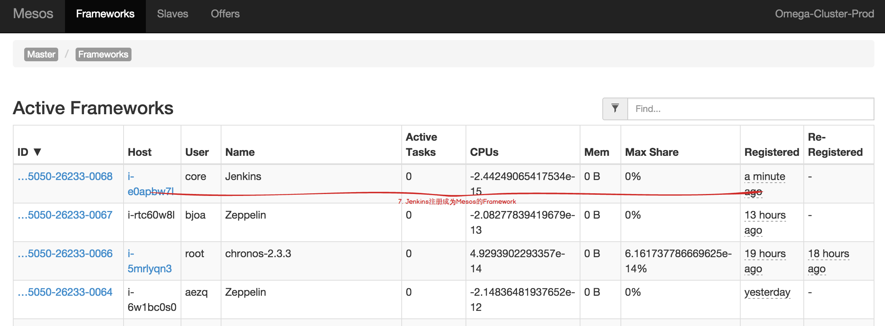
  <font size="2">&#8195;&#8195;&#8195;&#8195;&#8195;&#8195;&#8195;&#8195;&#8195;&#8195;图7-4-6  Jenkins framework on mesos</font>

现在我们可以同时启动多个构建作业来看一下 Jenkins 在 Mesos 上的弹性伸缩，在 ``http://192.168.3.25:31052/`` 上新建一个名为 ``test`` 的工程，配置其构建过程为运行一个 shell 命令 ``top`` ，如下图(图7-4-7)所示：

  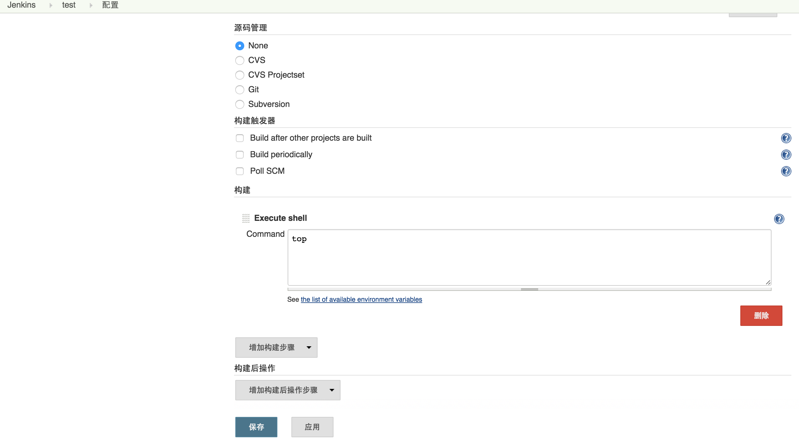
  <font size="2">&#8195;&#8195;&#8195;&#8195;&#8195;&#8195;&#8195;&#8195;&#8195;&#8195;图7-4-7  配置构建作业</font>

把该工程复制3份 ``test2``、``test3`` 和 ``test4``，并同时启动这4个工程的构建作业，Jenkins Master 会向 Mesos 申请资源，如果资源分配成功，Jenkins Master 就在获得的 slave 节点上进行作业构建，如下图(图7-4-8)所示：

  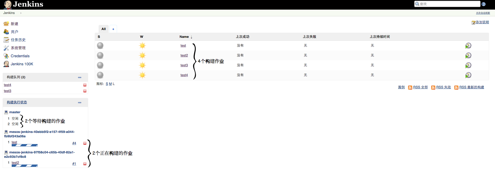
  <font size="2">&#8195;&#8195;&#8195;&#8195;&#8195;&#8195;&#8195;&#8195;&#8195;&#8195;图7-4-8  构建作业列表</font>

因为在前面的系统配置里我们设置了**执行者数量**为2（即最多有两个作业同时进行构建），所以在上图中我们看到两个正在进行构建的作业，而另外两个作业在排队等待。

下图(图7-4-9)展示了当前的Jenkins作业构建共使用了0.6CPU和1.4G内存,

  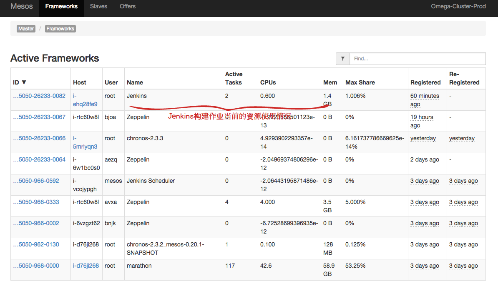
  <font size="2">&#8195;&#8195;&#8195;&#8195;&#8195;&#8195;&#8195;&#8195;&#8195;&#8195;图7-4-9  Jenkins 资源使用</font>
  
正在使用的slave节点的详细信息

  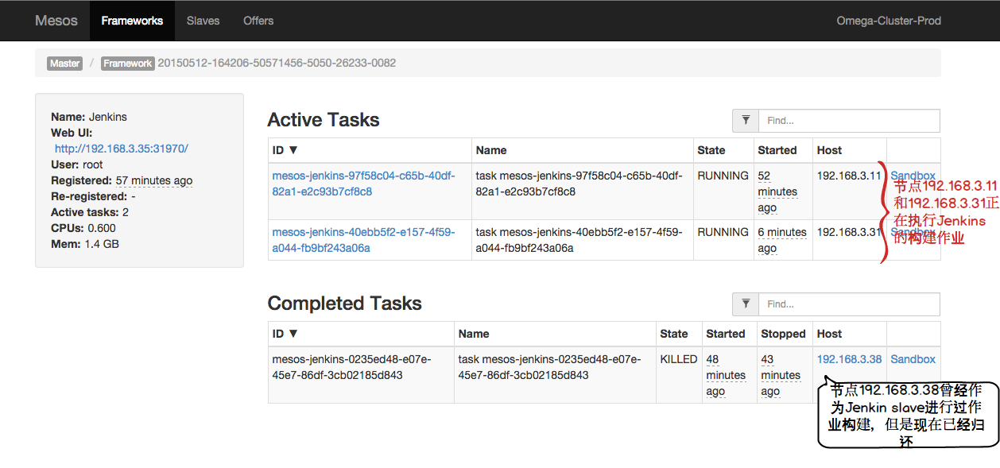
  <font size="2">&#8195;&#8195;&#8195;&#8195;&#8195;&#8195;&#8195;&#8195;&#8195;&#8195;图7-4-10  slave 节点详细信息</font>

  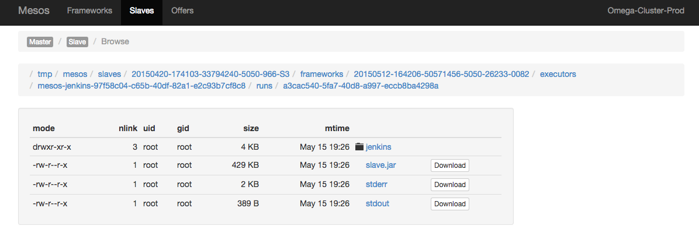
  <font size="2">&#8195;&#8195;&#8195;&#8195;&#8195;&#8195;&#8195;&#8195;&#8195;&#8195;图7-4-11  slave 节点详细信息</font>
  
#### 配置 Jenkins Slave 参数(可选)

在使用 Jenkins 进行项目构建时，我们经常会面临这样一种情形，不同的作业会有不同的资源需求，有些作业需要在配置很高的 slave 机器上运行，但是有些则不需要。为了提高资源利用率，显然，我们需要一种手段来向不同的作业分配不同的资源。通过设置 Jenkins Mesos Cloud 插件的 slave info，我们可以很容易的满足上述要求。 具体的配置如下图(图7-4-12)所示：

  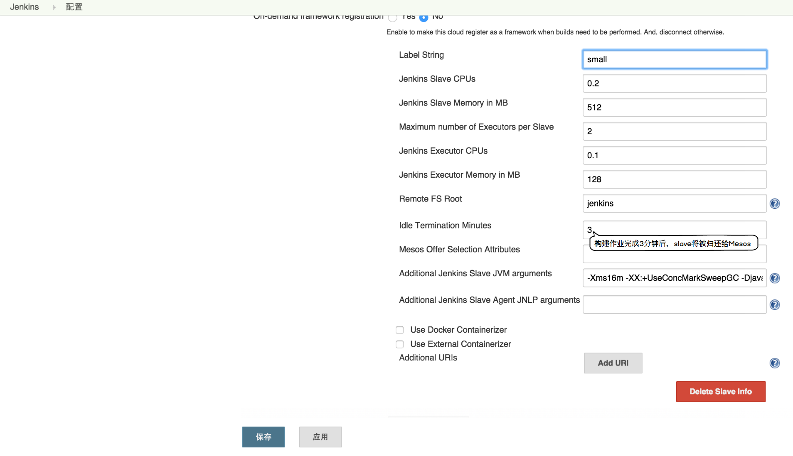
  <font size="2">&#8195;&#8195;&#8195;&#8195;&#8195;&#8195;&#8195;&#8195;&#8195;&#8195;图7-4-12  Jenkins 配置 slave</font>

1. ``Label String`` 设置: Slave 标签
2. ``Maximum number of Executors per Slave``: 每个 Slave 可以同时执行几个任务
3. ``Mesos Offer Selection Attributes``: 选择在哪些 Mesos Slave 标签资源上运行，格式
```json
{"clusterType":"标签"}
```

利用mesos为jenkins弹性的提供资源，同时配置Jenkins Slave的参数来满足不同作业的资源需求，这些都大大提高了集群的资源利用率。另外，由于 Marathon 会自动检查运行在它之上的app的健康状态， 并重新发布崩溃掉的应用程序。

## 7.4.2 如何达到 Jenkins 数据持久化

由于我们通过 Marathon 来启动 Jenkins Master ， 在 Jenkins Master 异常导致重新部署时，我们需要考虑 Jenkins Master 的数据持久化问题。 一种显而易见的方式是限制 Marathon 将 Jenkins Master 部署到同一个数据节点，但这会导致分布式的单点问题。 这里我们介绍另一种方法,即：使用 jenkins 插件 [SCM Sync configuration plugin](https://wiki.jenkins-ci.org/display/JENKINS/SCM+Sync+configuration+plugin) 来将数据同步到 git repo 上。把锅扔出去，扔到 github 上 :-)。

### 在内部的代码库或者 github 上创建一个 git repo

我们需要在内部的代码库或者公共代码库创建一个名为 **jenkins-on-mesos** 的 gitrepo ， 譬如：**git@gitlab.dataman.io:wtzhou/jenkins-on-mesos.git** 。 这个 repo 是 jenkins 插件 [SCM Sync configuration plugin](https://wiki.jenkins-ci.org/display/JENKINS/SCM+Sync+configuration+plugin) 用来同步jenkins数据的。

另外，对于 SCM-Sync-Configuration 来说，非常关键的一步是保证其有权限 pull/push 上面我们所创建的 gitrepo。 以我们公司的内部环境为例， 在 mesos 集群搭建时，我们首先使用 ansible 为所有的 mesos slave 节点添加了用户 **core** 并生成了相同的 **ssh keypair**，同时在内部的gitlab上注册了用户 **core** 并上传其在slave节点上的公钥，然后添加该用户 **core** 为 repo **git@gitlab.dataman.io:wtzhou/jenkins-on-mesos.git** 的 **developer** 或者 **owner**，这样每个 mesos slave 节点都可以以用户 **core** 来 pull/push 这个gitrepo了。

### 使用 marathon 部署可持久化的 Jenkins Master

我们首先需要 wget 两个文件:

  ```bash
  wget -O start-jenkins.app.sh https://raw.githubusercontent.com/Dataman-Cloud/jenkins-on-mesos/master/start-jenkins.app.sh.template
  wget https://raw.githubusercontent.com/Dataman-Cloud/jenkins-on-mesos/master/marathon.json
  ```

其中 ``start-jenkins.app.sh`` 是需要配置的，

  ```bash
  #! /bin/bash

  # Sync the config with SCM_SYNC_GIT
  # SCM_SYNC_GIT format: git@gitlab.dataman.io:wtzhou/jenkins-on-mesos.git
  SCM_SYNC_GIT=

  # deploy jenkins on marathon as user APP_USER, who has been granted to pull/push repo SCM_SYNC_GIT
  APP_USER=

  # Marathon PORTAL, for example: http://192.168.3.4:8080/v2/apps
  MARATHON_PORTAL=
  ......
  ......
  ......
  ```

编辑如下3个变量：

  1. **SCM_SYNC_GIT**: 上面所配置的 gitrepo 地址, 格式例子： git@gitlab.dataman.io:wtzhou/jenkins-on-mesos.git
  2. **APP_USER**: marathon 会以用户 **APP_USER** 来部署 jenkins ，从而插件**SCM-Sync-Configuration**会以用户**APP_USER**来跟gitrepo进行同步。 所以在我们的这个例子里，我们让``APP_USER=core``。
  3. **MARATHON_PORTAL**: marathon 的 RESTapi 入口，例如： http://marathon.dataman.io:8080/v2/apps

接下来就可以执行命令:

  ```bash
  bash start-jenkins.app.sh
  ```

来让 marathon 部署我们的 Jenkins Master 了。这样， 我们在 Jenkins Master 上所保存的任何配置，创建的任何job都会被 **SCM-Sync-Configuration** 同步到 repo 里，并在 Jenkins Master 被重新发布后 download 到本地。

### 关于SCM-Sync-Configuration的更多信息

SCM-Sync-Configuration 初始化完成后（在我们环境里初始化过程会被自动触发)，每次配置更新或者添加，编辑构建作业时，我们会得到一个提示页面来为新的 commit message 添加 comment，如下图(图7-4-13)所示， 

  
  <font size="2">&#8195;&#8195;&#8195;&#8195;&#8195;&#8195;&#8195;&#8195;&#8195;&#8195;图7-4-13  commit comment</font>

当前，所支持的配置文件如下：

  1. 构建作业的配置文件 (/jobs/*/config.xml)
  2. 全局的 Jenkins/Hudson 系统配置文件 (/config.xml)
  3. 基本的插件的配置文件 (/hudson*.xml, /scm-sync-configuration.xml)
  4. 用户手动指定的配置文件

另外，我们可以在每一页的下面看到 scm sync config 的状态， 下图(图7-4-14)是同步出错时的截图，你可以去**System Log**查看具体的出错信息。

  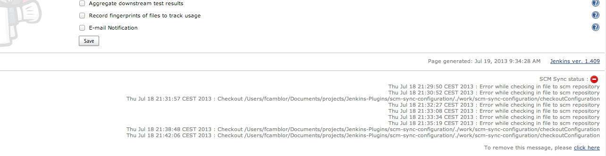
  <font size="2">&#8195;&#8195;&#8195;&#8195;&#8195;&#8195;&#8195;&#8195;&#8195;&#8195;图7-4-14  scm sysnc status</font>