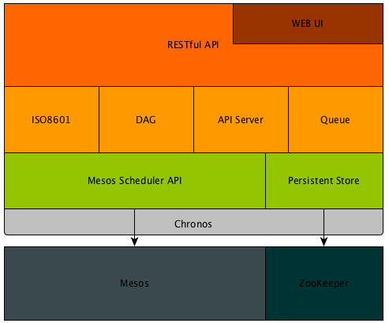

# Chronos 简介

Chronos 是一个基于 Mesos 的分布式的 Cron 任务处理框架，最初由 Airbnb 公司开发，
目前由 Mesosphere 公司负责维护。作为短任务框架，Chronos 几乎可以用于任何地方，
只要用户有批处理任务需求即可，特别是原生支持 Docker 以后，Chronos
任务的运行环境将不再受到 Mesos 计算结点的限制。

## Chronos 架构

Chronos 在架构上和 Marathon 非常相似，只是二者面向的业务类型不同，Chronos 主要面向批处理任务，定时重复执行的任务，而 Marathon 面向长时运行任务。

下图是 Chronos 官方的一个示例架构图：

其中矩形框内是 Chronos 架构，而框外部是其它服务。所以，Chronos 本身是一个运行在 Mesos 之上的框架。

## Chronos 工作原理

下图展示了 Chronos 内部功能模块：

主要包含了以下几个功能模块：

  - Mesos Scheduler API，主要负责实现 Mesos 定义的 Scheduler API 接口，以便和
    Mesos 通信，获取资源，提交任务，获得任务状态更新等事件
  - Persistent Store，Chronos 使用 ZooKeeper 作为数据持久化存储后端，
    所有需要存储的数据都存储在 ZooKeeper 中；所以，除了依赖于 Mesos 外，Chronos 还依赖于 ZooKeeper。
  - ISO8601 模块负责解析 ISO8601 标准定义的重复任务属性
  - DAG，有向无环图实现了对任务间依赖关系的支持，任务间依赖也是 Chronos 的一大亮点，当所有前置任务完成后，后置任务会被自动触发
  - API Server，一个 Web API Server 负责接收处理收到的 API 请求，Chronos 实现了高可用性，在任意时刻，同一个服务中只有一个 Chronos 实例作为 Leader 负责处理请求，其它 Chronos 实例的 API Server 此时会将请求转发给 Leader
  - Queue，任务队列，以便将可运行的任务调度到队列中，在有合适资源时将任务调度到 Mesos 集群中运行
  - RESTful API，Chronos 提供了完善的 RESTful API 来使用 Chronos
  - WEB UI，Chronos 也提供了 Web 用户界面，能够实现对任务的大部分操作

在了解了 Chronos 各个功能模块之后，也就大概了解了 Chronos 工作原理，总的来说：作为一个 Mesos 计算框架，计算资源的获取，计算任务状态更新都需要由 Mesos 来辅助完成，所以 Chronos 主要实现了对任务的存储，调度，搜索等任务逻辑层的功能。

## Chronos 特性

Chronos 作为一个分布式的 Cron 批处理任务计算框架，除了支持定时任务外，还有许多高级特性：

  - Web 用户界面
  - RESTful API
  - ISO8601 重复任务支持
  - 任务依赖关系
  - 任务状态查看及任务历史
  - 可配置的失败重试次数
  - 屏蔽底层结点故障
  - 原生 Docker 支持

下面对每个特性分别做简要介绍。

### Web 用户界面

Chronos 的 Web 用户界面如下图所示：

在这个 Web 用户界面，用户可以完成大部分操作，包括对任务的增删查改，
搜索，查看状态，运行历史等等。

但是，需要注意的是，Chronos Web 用户界面的性能并不高，当 Chronos
上积累的任务过多时，会导致加载速度变慢。所以，如果对 Chronos 使用量较大，
推荐使用 API 方式管理任务，更高效。

### RESTful API

Chronos 提供了完善的 RESTful API，完善的 API 对于批处理任务框架来说比 Web
用户界面更重要，因为批处理任务往往意味着运行时间短，量大，所以通过 Web
用户界面来控制批处理任务显得非常低效，这时，通过 API 控制任务显然更加高效。

### ISO8601 重复任务支持

和 Cron 标准类似，ISO8601 定义了一种表示重复任务的标准，包括对：日期，时间，间隔，重复的定义，例如：`R3/2015-12-20T13:44:00Z/P1Y2M10DT2H30M10S` 表示从 UTC 时间 2015 年 12 月 20 日 13 点 44 分 00 秒开始，以间隔 1 年 2 个月 10 天 2 小时 30 分 10 秒发生 3 次；所以，事件的第一次发生会在 2015 年 12 月 20 日 13 点 44 分 00 秒，第二次发生则在 1 年 2 个月 10 天 2 小时 30 分 10 秒之后。

### 任务依赖关系

Chronos 通过 DAG（有向无环图）实现了任务依赖关系的支持，依赖任务只有在其所有被依赖任务成功完成之后才会被触发，所以用户可以定义非常复杂的任务依赖关系；显然，互相依赖或者闭环的依赖是不被允许的。

### 任务状态查看及任务历史

Chronos 会在 Web 用户界面实时显示当前任务的状态，并且用户可以手动激活任务。由于任务可能会被重复执行，Chronos 还支持对任务历史状态的查看。

### 可配置的失败重试次数

用户可以针对每个任务配置失败重试任务，当任务在失败时自动进行重试，非常方便。

### 屏蔽底层结点故障

由于 Mesos 能够区分任务的失败是由于任务自身运行的失败还是由于底层计算节点故障导致的任务失败，所以 Chronos 能够自动屏蔽由计算结点导致的任务失败，并对用户屏蔽这种失败，自动发起重试。

### 原生 Docker 支持

原生 Docker 支持的引入，使 Chronos 任务不再依赖于 Mesos 计算结点的环境，例如：Chronos 的任务可能需要调用某一个外部命令，而这个外部命令如果不存在，显然会导致任务的失败。

另外，使用 shell executor 执行 Chronos 任务也非常危险，因为有可能任务中包含了破坏性的命令，一旦以不当的权限运行，那么将会对 Mesos 计算节点造成破坏，例如：以 root 用户权限执行了 `rm -rf /` 显然会破坏整个 Mesos 计算结点。

所以，对 Docker 的原生支持极大的提高了 Chronos 的可用性。

