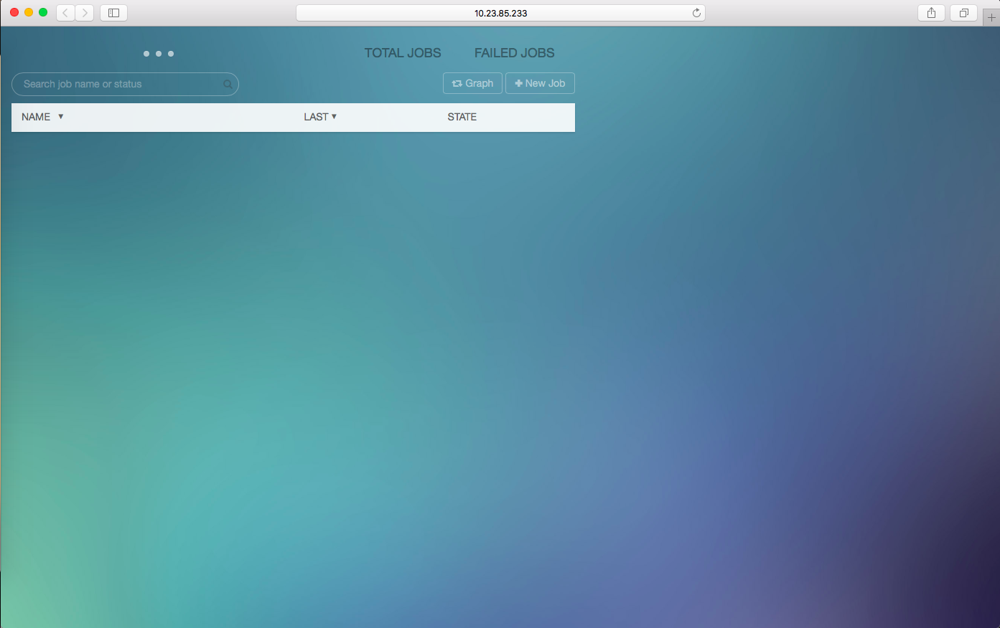
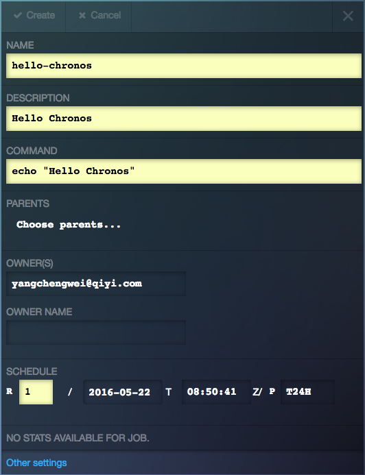
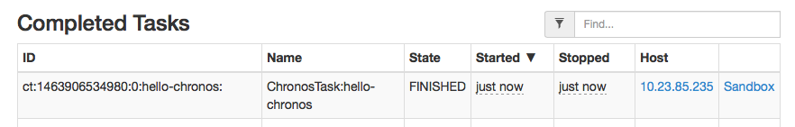
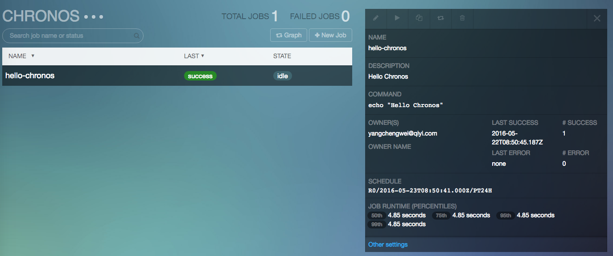
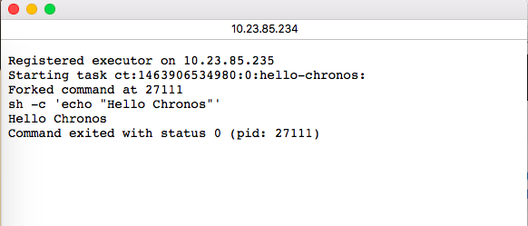

# 运行Chronos任务

在搭建了 Chronos 服务后，就可以使用 Chronos 来运行任务了，Chronos
面向的是基于时间的可重复的短时运行任务。

  - 基于时间：任务在指定的时间点开始执行，也可以是即时任务，提交后立即执行
  - 可重复：任务可以配置重复执行的策略
  - 短时运行：任务在运行一段时间后会结束
  - 任务间依赖：任务间可以有依赖关系
  - 同步、异步任务

Chronos 同时提供了 RESTful API 和 Web 用户界面来管理任务，这里分别对其进行介绍。

## Web 用户界面

Chronos Web 用户界面的主页如下图所示：



通过 Web 用户界面可以提交任务，查看任务状态，历史运行情况等，还可以搜索任务。
下面提交一个任务输出 "Hello Chronos!"。如下图所示：



这里我们提交的是一个即时任务，所以任务一旦提交就会被立即调度，如果 Mesos
集群有资源，那么任务将立即启动，否则将在 Chronos 调度队列中等待。

很快，可以发现任务已经完成了，如下图所示：



从 Chronos web UI 也可以看到任务的状态，如下图所示：



但是，任务的输出从哪里查看呢？可以从 Mesos Web 用户界面找到这个任务，并且进入
`Sandbox` 中，查看 `stdout` 文件，即可找到。如下图所示：



可见，Mesos 启动了 shell 执行器来执行 Chronos 任务的命令，由于这里只执行了一条
`echo` 命令，所以可以在 Web 用户界面上输入，但是，如果任务要执行的是一个脚本呢？
再从 Chronos Web 用户界面输入显然不合适：

  - 每次输入比较麻烦，容易输入错误等
  - Web UI 使用起来比较低效

下面来看看怎样使用 Chronos API 来管理任务。

## RESTful API

创建一个叫 `hello-chronos.sh` 的脚本，内容如下：

```
#!/bin/sh
set -e
echo "Hello Chronos!"
echo "This is a complicated script"
sleep 10
echo "Mission complete"
```

并且将这个文件放到一个在 Mesos 计算节点上可以访问的地方，
例如：HDFS, HTTP 服务器，甚至计算结点上。这里将这个脚本部署在了所有计算结点上，
存放在 `/usr/local/mesos/chronos/hello-chronos.sh`，并且赋予可执行权限：

```
# chmod +x /usr/local/mesos/chronos/hello-chronos.sh
```

在这里，读者可能在好奇为什么不把脚本放在例如：HDFS 或者 HTTP 服务器上，
而是将其部署在 Mesos 计算节点上。在实际生产环境中，为了加快任务启动速度，
往往会选择将需要下载的文件都部署在本地，这样能够避免网络下载时间，
避免网络抖动带来的影响等。特别是当需要下载的文件特别大时，部署在本地就更能加快任务启动速度。

另外，对于短时任务来说，启动速度更加重要，因为短时任务运行的时间一般不长。

对于批处理任务来说，通过 API 提交的方式更加高效实用，Chronos 提供了完善的
RESTful API，这里将介绍怎样实用 API 来提交任务，完整的 API 读者可以参考 Chronos
官方文档。

以提交 `hello-chronos.sh` 为例，创建一个 hello-chronos.json，内容如下：

```
{
    "name": "hello-chronos-script",
    "command": "./hello-chronos.sh",
    "uris": [
        "/usr/local/mesos/chronos/hello-chronos.sh"
    ]
}
```

然后，使用 curl 命令提交这个任务：

```
$ curl -H 'Content-Type: application/json' -X POST -d @hello-chronos.json http://10.23.85.233:8080/scheduler/iso8601
```

这里使用了 `curl` 作为 HTTP 客户端提交任务，各个参数的意义如下：

  - `-H`, 指定 HTTP header
  - `-X`, 指定方法，HTTP 支持多种方法，常见的有：GET, POST, PUT, DELETE
  - `-d`, 设置负载数据，这里的数据是 JSON 内容

最后指定的是 Chronos 服务地址及其 API 地址。

提交完成后，前往 Chronos Web 用户界面，可以看到刚才提交的任务已经完成了，如下图所示：


这是因为上面的命令提交的是一个即时任务。在 Chronos 中，省略 `schedule`
表示即时任务，即提交后立即执行。

现在，对上面的 hello-chronos.json 稍作修改，变成一个重复执行的定时任务。

```
{
    "schedule": "R3/2016-05-23T09:30:00.000Z/PT5M",
    "name": "hello-chronos-script-cron",
    "command": "./hello-chronos.sh",
    "uris": [
        "/usr/local/mesos/chronos/hello-chronos.sh"
    ]
}
```

上面的命令，相较于上一次的提交有两个改变：

1. `name` 为 `hello-chronos-script-cron`，这是因为 Chronos 任务中的 name 必须唯一
2. `schedule` 为 `R3/2016-05-23T09:30:00.000Z/PT5M`，R3 表示任务要执行 3
   次，2016-05-23T09:30:00.000Z 表示在 UTC 时间 2016 年 05 月 23 日 09
   点 30 分开始第一次执行，也就是北京时间的 17 点 30 分，PT5M 表示重复执行的间隔为 5
   分钟

## 基于 Docker 的任务

前面介绍的任务使用的都是 shell 执行器来执行的，所以会直接在 Mesos
计算节点上以配置的用户执行，如果执行的脚本中有误操作，例如：删除系统上的文件，
那么将非常危险。用户不恰当的操作可能会破坏平台的计算环境甚至稳定性。

而使用 Docker，可以将任务的运行环境更好的隔离，包括文件系统方面的隔离，
所以更加安全，同时，任务也将不再依赖于 Mesos 计算结点上的环境，例如：任务需要
Python 3 环境但是计算结点只有 python 2.x 环境，用户需要 Go
运行环境，但是计算结点却没有安装 Go 等。

Chronos 和 Mesos 都原生支持 Docker 任务，所以这里将提交一个 Docker 任务，
并且同样的，将执行 `hello-chronos.sh` 脚本。

首先，构建一个 Docker 镜像，将 `hello-chronos.sh` 放在 Docker 镜像中，
并且设置为启动命令，构建镜像的 Dockerfile 如下所示：

```
FROM alpine
MAINTAINER Chengwei Yang <me@chengweiyang.cn>

ADD hello-chronos.sh /
RUN chmod +x /hello-chronos.sh

CMD ["/hello-chronos.sh"]
```

将 `hello-chronos.sh` 和 Dockerfile 都保存在同一个目录中，如下所示：

```
$ tree .
.
├── Dockerfile
└── hello-chronos.sh

0 directories, 2 files
```

然后构建 Docker 镜像，如下所示：

```
$ docker build -t mesos-in-action/hello-chronos:v1 .
$ docker push mesos-in-action/hello-chronos:v1
```

将 Docker 镜像上传到 Docker Hub 之后，就可以提交任务了。创建一个 hello-chronos-docker.json 文件，内容如下：

```
{
  "name": "hello-chronos-docker",
  "container": {
    "type": "DOCKER",
    "image": "mesos-in-action/hello-chronos:v1"
  },
  "cpus": "0.5",
  "mem": "512",
  "command": ""
}
```

然后，使用 curl 命令提交这个任务，命令行和前面的一样：

```
$ curl -H 'Content-Type: application/json' -X POST -d @hello-chronos-docker.json http://10.23.85.233:8080/scheduler/iso8601
```

任务提交后，当任务被初次调度到计算结点时，计算结点需要下载 Docker
镜像，这需要花一定的时间，视网络情况而定。由于 Docker Hub
在国内非常慢，甚至有时不可访问，所以读者也可以配置 Mesos 计算节点使用一些国内的
Docker Hub 镜像服务，例如：道客云提供永久免费的 Docker Hub 镜像服务。

另外，在实际生产环境中，往往选择搭建私有的 Docker
镜像服务，这部分内容这里不再介绍。
