# 运行 Marathon 任务

在搭建了 Marathon 框架后，本节将介绍怎样提交一个任务到 Marathon，通常，我们将
Marathon 任务称作为 App，Application 的缩写。

本节将首先介绍怎样使用 Marathon 启动一个 `Hello Marathon` 任务，然后介绍怎样运行基于 Docker 的任务：怎样搭建一个 Web 版 2048 游戏。

## Hello Marathon

这里将创建一个 `hello-marathon` App 来演示怎样通过 Marathon Web 界面创建 App。

Marathon Web 顾名思义就是 Marathon 的 Web 界面，通过 Marathon Web 界面，可以了解很多有用的信息，例如：有多少 App 正在运行，各个 App 的实例列表，运行状态等等。不仅如此，还可以通过 Web 界面实现一些对 App 的控制，例如：调整实例数，暂停 App，删除 App，创建 App 等。

用浏览器打开已经启动的 Marathon 服务（http://10.23.85.233:8080），如下图所示：

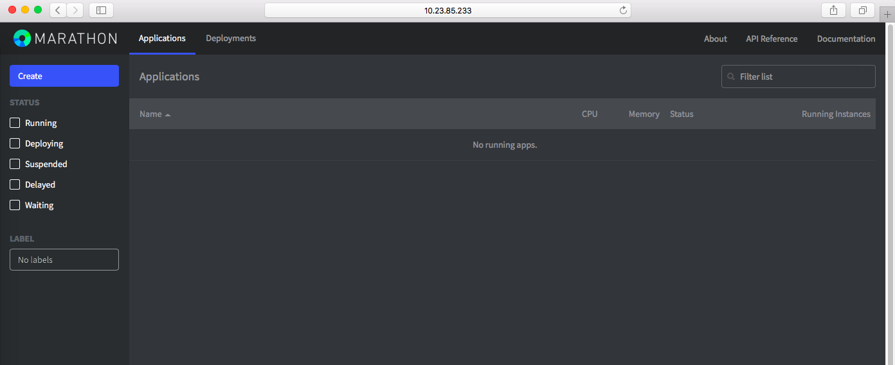

点击左上角的 **Create** 按钮创建一个新的 App, 如下图所示：

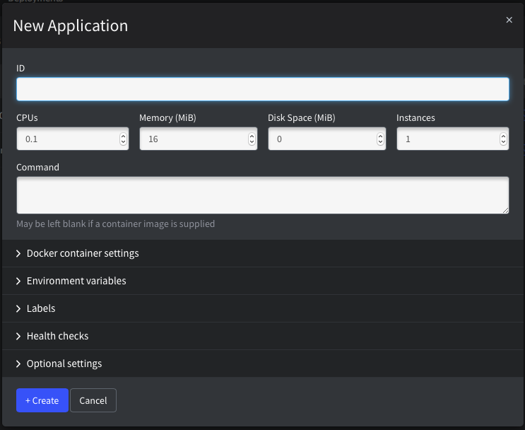

在新建页面，可以配置很多应用的选项，主要包括以下几部分：

  - 基本信息，容器资源配置等
  - Docker 容器配置，如果使用了 Docker 来封装应用的话
  - 环境变量，会被传递给应用
  - 标签，方便过滤，归类等
  - 健康检查
  - 其它可选配置

为了创建 `hello-marathon`，我们只需要输入几个必须的配置即可，如下图所示：

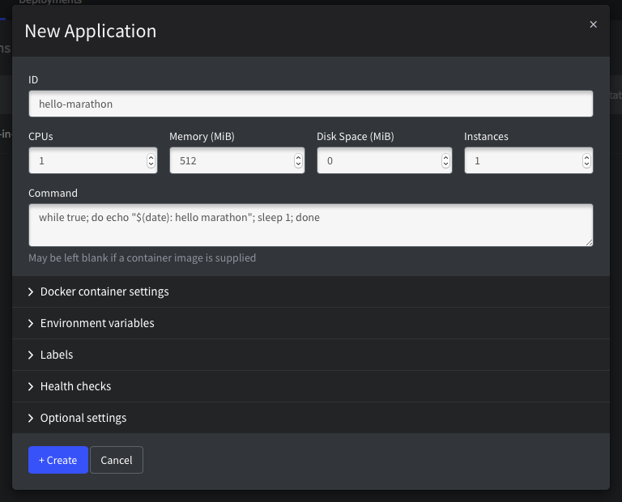

输入完成后，点击 **+Create** 完成 App 的创建，现在，在 Marathon Web 上，可以看到刚才创建的 `hello-marathon` 已经处于 `Running` 状态了，如果用户操作足够快，应该还能看到在 `Running` 之前，还有一个 `Deploying` 状态；其对应于 Mesos 中的 `Staging` 状态，表示正在启动任务。

Mesos 的任务具有以下几个状态：

  - Staging，表示任务已经收到，正在准备启动
  - Running，任务已经启动
  - Failed，任务失败
  - Lost，任务丢失
  - Killed，被杀死

在 Marathon 界面，点击 `hello-marathon` 可以看到这个 App 的详情，在 `Tasks` 卡片页可以看到当前 App 的实例；在 `Configuration` 卡片页可以看到任务配置的详情，历史版本等信息，如下图所示：

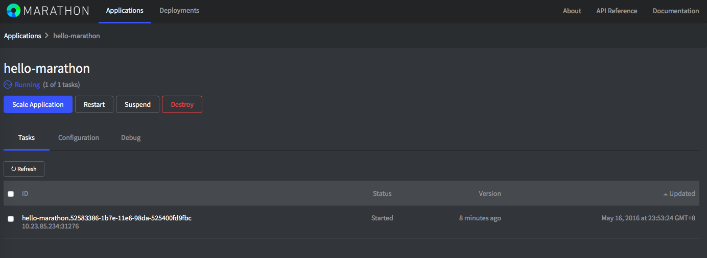

另外，在上方还有几个控制按钮：

  - Scale Application, 调整 App 运行实例数量
  - Restart，重启 App 所有实例
  - Suspend, 挂起 App，相当于杀死所有正在运行的实例，但是保留 App 的配置
  - Destroy App, 彻底删除 App

从 Tasks 中，可以看到，`hello-marathon` 启动了一个任务，运行在 10.23.85.234 上，那么，怎样看到 `hello-marathon` 的输出呢？`hello-marathon` 任务执行了如下任务：

```
while true; do echo "$(date): hello marathon"; sleep 1; done
```

任务的效果是每隔 1 秒钟，输出 `hello marathon` 字符串，所以我们应该能够在任务进程的 `stdout` 看到输出。

现在我们打开 Mesos 集群页面，在 `Slaves` 页面，找到这个计算节点，然后进入结点页面，找到 `hello-marathon` 这个任务，如下图所示：


点击任务后面的 `Sandbox` 链接，可以看到当前任务运行的目录，这里有两个文件：

  - stdout, 任务的 stdout 输出会被重定向到这个文件
  - stderr, 任务的 stderr 输出会被重定向到这个文件

所以，打开 stdout 文件的内容，就可以看到 `hello-marathon` 输出了，如下图所示：

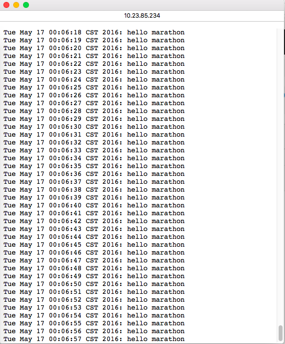

并且，保持这个文件打开，文件内容会自动更新，实时查看到任务的 stdout，非常棒！

好了，现在已经通过 Marathon Web 界面创建了一个 App，并且这个 App 只有一个实例在运行，那么，试试运行两个实例呢，只需要点击在 Marathon Web 界面上点击 `Scale Application`，然后输入数字 `2` 即可，可以看到，很快就会有两个 `hello-marathon` 实例在运行了，如下图所示：

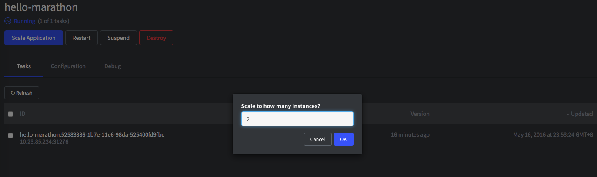

同样，可以通过 `Suspend` 来暂停 App，这里的暂停不是让已经在运行的两个实例进程暂停，而是整个 App 意义上的暂停，即停止所有正在运行的实例，所以任务会被杀死；但是，可以很方便的恢复运行，`Destroy` 不仅会杀死所有正在运行的实例，还会将 App 配置一起删除。

## Hello Docker-2048

`hello-marathon` 实际上是将任务直接运行在 Mesos 计算结点上的，运行环境需要由计算结点来保证，例如：hello-marathon 运行了 shell 脚本，那么计算结点上必须有 shell 环境；如果 App 要依赖 python 环境，perl 环境，PHP 环境，Go 环境等等，那么可以想见，为了运行任务，计算节点上必须同时支持所有需要的环境；计算结点将非常臃肿，甚至，如果任务使用的环境有冲突，那么这时计算结点就无能为力了。

Docker 一面世，就掀起了一场云计算革命，Docker 能够将任务运行在隔离的环境中，各自任务都将自己的依赖环境全部打包到 Docker 镜像中，所以不再对底层的计算结点强依赖；相反，只需要底层计算结点支持运行 Docker 即可。

Mesos 和 Marathon 也原生对 Docker 进行了支持，所以，用户可以很方便的将 Docker 任务通过 Marathon 调度到 Mesos 集群中执行。这里将创建一个 基于 Docker 的 Marathon App：docker-2048。

同样，在 Marathon WEB 界面中，点击 **Create** 按钮来创建新的 App，这里输入如下图所示参数：

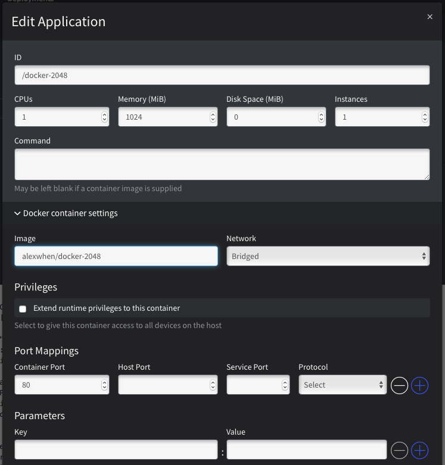

虽然这里还有很多其它配置项，但是只需要输入上图中的几项即可，非常简单，和 `hello-marathon` 相比，这里有以下几点不同：

  - 没有输入 **Command** 参数
  - 输入了一个 **Docker Image**，表示将启动这个 Docker 镜像
  - 选择了使用 Bridged 模式的网络，默认为无
  - 一个容器端口参数 80

以上参数表示：在启动这个应用时，从 Docker 镜像启动，并且使用 Bridged 网络模式将容器内部的 80 端口随机映射到主机上。

输入完成后，点击 **+Create** 按钮，创建应用，稍等一段时间后，可以看到，任务已经启动了，如下图所示：

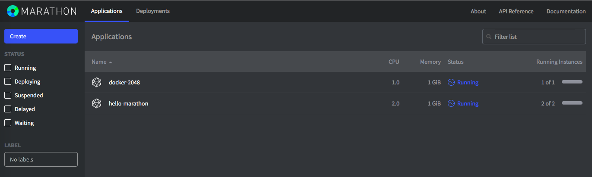

打开 `docker-2048` 应用详情页面，找到 Task 所在的主机，如下图所示：

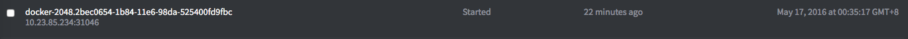

点击任务下面的主机端口号，将在新的浏览器页面中打开该地址，如下图所示：

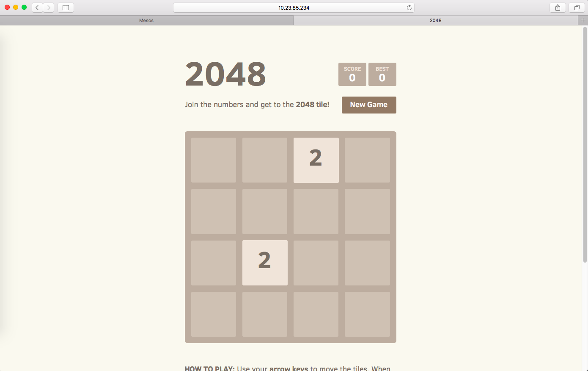

可以看到，一个基于 Web 的 2048 游戏已经运行起来了，酷！

**注意：考虑到国内特殊情况，如果不能访问 alexwhen/docker-2048 镜像，那么任务将不能启动**

## 使用 API 来创建 App

Marathon 提供了比 Web 界面功能更强大的 RESTful API，相应地，Marathon Web 界面实际上也通过 Marathon API 来管理 App。

Marathon API 采用 JSON 格式来封装数据，如下为 `docker-2048` 的 JSON 数据，我们将其保存在一个名为 `docker-2048.json` 的文件中。

```
{
    "id": "docker-2048-created-by-api", 
    "container": {
        "type": "DOCKER",
        "docker": {
            "image": "alexwhen/docker-2048",
            "network": "BRIDGE",
            "portMappings": [
                { "containerPort": 80, "hostPort": 0 }
            ]
        }
    },
    "cpus": 0.5,
    "mem": 512.0,
    "instances": 1
}
```

可以看到，`docker-2048.json` 内容非常简单，除了之前已经在 `hello-marathon` 中使用过的几个参数：

  - id, App 唯一标识
  - cpus, 申请使用的 CPU
  - mem, 申请使用的内存
  - instances, 实例数

这里多了另一个参数：`container`，它又有几个参数组成：

  - type, 指定 container 的类型，这里是 `DOCKER`
  - docker, 指定 docker 的一些参数
    - `image`，指明使用的 Docker 镜像
    - `portMappings`, 指明端口映射规则，containerPort 表示容器内部端口，hostPort 表示映射到计算结点的端口，0 表示随机分配

Marathon API 中关于 App 的定义还有许多参数，这里只介绍了最简单的运行 Docker 任务的几个必须参数，其它参数后面将分类做简单介绍。

现在，使用任何支持传递 JSON 数据的客户端都可以向 Marathon 提交这个 App 了，只需要遵守 Marathon 定义的 API 格式。

下面使用 curl 来提交 `docker-2048.json` 到 Marathon 以便创建 docker-2048 这个 App，创建 App 的 API 格式如下：

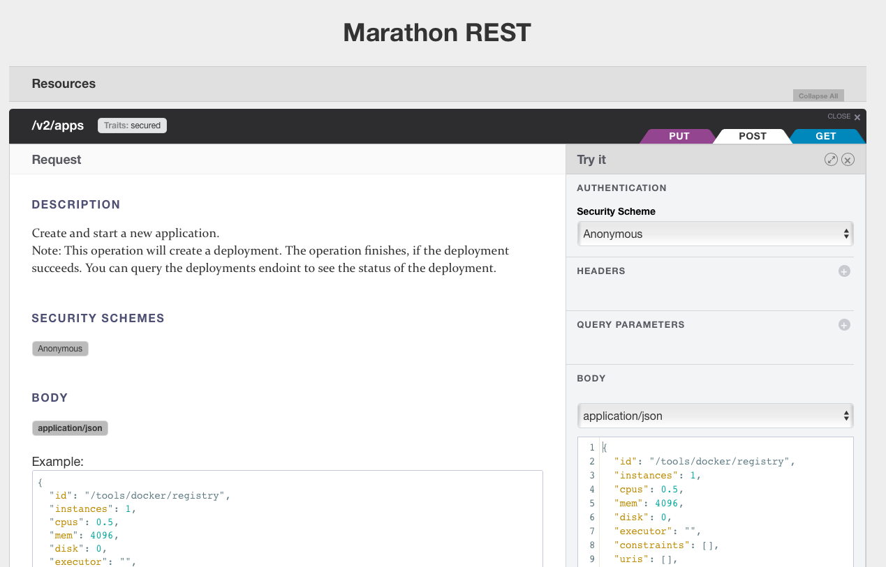

所以，只需要将 `docker-2048.json` 使用 POST 方法提交到 Marathon 服务的 /v2/apps 即可。这里我们将使用 `curl` 作为客户端来提交 `docker-2048.json`，如下所示：

```
$ curl -H "Content-type: application/json" -d @docker-2048.json -X POST http://10.23.85.233:8080/v2/apps
```

`curl` 是一个在 Linux 环境下广泛使用的 HTTP 客户端，支持 JSON 格式的数据，上面的命令中，使用了 3 个选项：

  - `-H`, 添加一个 HTTP Header
  - `-d`, 数据，`@` 符号表示使用该文件的内容
  - `-X`, 指定使用的方法，常用的 HTTP 方法还有 GET，POST，DELETE 等

提交完成后，可以看到 Marathon Web 界面上新建了一个叫做 `docker-2048-created-by-api` 的 App，如下图所示：

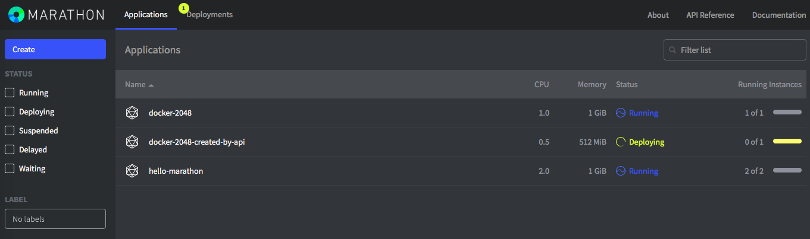

## Marathon 任务配置

在前面两个例子中，我们只使用非常少的几个配置参数就创建了 Marathon App，其实，Marathon App 有非常多配置，可以配置 App 的方方面面，下面介绍两类最常用的任务配置：

  - 健康检查
  - Constraints

健康检查能够根据 App 配置来检查 App 是否健康，并且在不健康的时候采取相应的动作；而 Constraints 则能够控制 App 在制定的结点上运行。

### 健康检查

作为长时任务，我们总是期望任务在运行的时候都是正常的，而不是表面上在运行，实际上却不正常了。以 Web 服务来说，许多反向代理或者负载均衡器都提供健康检查机制，例如：Nginx, HAProxy 等；类似地，Marathon 对任务也提供了健康检查机制。

Marathon 健康检查机制分为 3 类：

  - HTTP, 定时访问指定 HTTP 接口，根据返回状态码来判断任务是否健康
  - TCP, 定时建立到任务的 TCP 连接，根据是否可连接来判断任务是否健康
  - COMMAND, 定时执行一个命令，根据命令的返回值来判断任务是否健康

Marathon 还提供了可以配置的策略，当检查到任务不健康时，可以采取相应的动作，例如：杀死当前实例并且启动一个新的实例。

以 `docker-2048` 为例，我们可以添加一个 HTTP 机制的健康检查，添加后，`docker-2048-v2.json` 将变成下面这个样子：

```
{
    "id": "docker-2048-created-by-api-v2", 
    "container": {
        "type": "DOCKER",
        "docker": {
            "image": "alexwhen/docker-2048",
            "network": "BRIDGE",
            "portMappings": [
                { "containerPort": 80, "hostPort": 0 }
            ]
        }
    },
    "cpus": 0.5,
    "mem": 512.0,
    "instances": 1,
    "healthChecks": [
        {
            "protocol": "HTTP",
            "path": "/",
            "gracePeriodSeconds": 30,
            "intervalSeconds": 10,
            "portIndex": 0,
            "timeoutSeconds": 10,
            "maxConsecutiveFailures": 3
        }
    ]
}
```

我们在 `docker-2048-v2.json` 中添加了一个 `healthChecks` 配置，其中包含一个配置，使用的是 HTTP 方式，各参数的含义如下：

  - protocol, 检查方式，可选的为：HTTP, TCP, COMMAND
  - path, uri 路径，可选的，默认为 '/'，只对 HTTP 有用
  - gracePeriodSeconds, 任务变成 Running 后多长时间内忽略健康检查失败事件，默认为 15 秒，如果任务启动后需要很长一段时间才能提供服务，例如：可能进行内部初始化需要很长事件，那么最好设置一个较大值，或者不要使用该参数，则表示直到第一次任务变成 health 未知
  - portIndex, 第几个内部端口，默认值为 0，docker-2048 在 portMappings 中只配置了一个端口，所以也只能指定为 0
  - timeoutSeconds, 单次健康检查的超时，默认为 10 秒
  - maxConsecutiveFailures, 最大连续失败次数，达到指定次数后，任务将被杀死，默认为 3

在更新了 `docker-2048-v2.json` 后，我们可以通过 `curl` 来提交更新后的 App，如下所示：

```
$ curl -H "Content-type: application/json" -d @docker-2048-v2.json -X PUT http://10.23.85.233:8080/v2/apps/docker-2048-created-by-api
```

更新已有 App 使用的是 PUT 方法，并且需要在 url 中指定原有 App 的 id，这里为 `docker-2048-created-by-api`。

更新完成后，打开 Marathon Web 界面，可以看到 docker-2048-created-by-api 的 **Running Instances** 状态处显示了一条绿色的进度条，如下图所示：

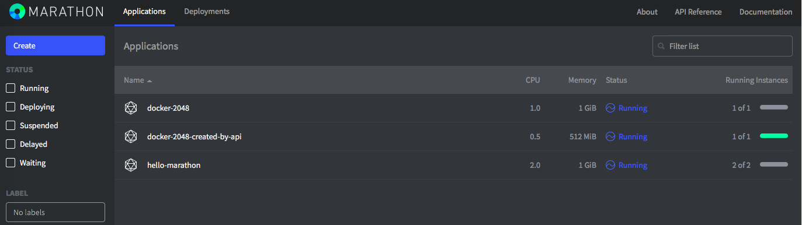

绿色表示该 App 所有运行实例都正常。

### Constraints

在一个实际生产环境中，Mesos 集群的计算结点可能具有差异性，例如：

  - 从机器类型看：结点可能虚机或者是物理机
  - 从网络带宽看：结点可能配备了千兆网卡，万兆网卡，40G 网卡等
  - 从是否可访问英特网看：结点可能是外网直连，通过代理，NAT，或者不能访问英特网
  - 从网络运营商看：结点可能使用电信，联通，移动等网络出口

以及还有很多其它方面，所以，如果 App 对结点配置有要求，那么就需要使用 `constraints` 来限制只能在制定的结点上启动 App 运行实例，要使用 `constraints` 来过滤计算结点，需要为结点配置适当的属性（attributes），这些属性可以在启动 mesos-slave 进程的时候配置。

除了 mesos-slave 配置的属性外，Marathon 还支持按照计算节点名字过滤。

除了用来过滤计算结点外，`constraints` 还可以用来控制 App 运行实例的分布特性，例如：

  - 平均分布：尽量在启动实例的结点上均匀分布实例
  - 唯一分布：在一个计算节点上只能启动一个运行实例

这里，我们为 `docker-2048` 添加一个基于主机名的限制条件，使其只能运行在 `10.23.85.234` 上，修改后的 `docker-2048-v3.json` 内容如下：

```
{
    "id": "docker-2048-created-by-api",
    "container": {
        "type": "DOCKER",
        "docker": {
            "image": "alexwhen/docker-2048",
            "network": "BRIDGE",
            "portMappings": [
                { "containerPort": 80, "hostPort": 0 }
            ]
        }
    },
    "cpus": 0.5,
    "mem": 512.0,
    "instances": 1,
    "healthChecks": [
        {
            "protocol": "HTTP",
            "path": "/",
            "gracePeriodSeconds": 30,
            "intervalSeconds": 10,
            "portIndex": 0,
            "timeoutSeconds": 10,
            "maxConsecutiveFailures": 3
        }
    ],
    "constraints": [["hostname", "LIKE", "10.23.85.234"]]
}
```

然后，使用 `curl` 命令提交修改后的 `docker-2048-v3.json` 到 Maraton，更新已经存在的 `docker-2048` App。

```
$ curl -H "Content-type: application/json" -d @docker-2048-v3.json -X PUT http://10.23.85.233:8080/v2/apps/docker-2048-created-by-api
```

App 更新后，可以看到 App 的一个实例在 `10.23.85.234` 上运行了，限制，可以测试将 App 运行实例数设置为 4，可以看到，随后又在 `10.23.85.234` 上启动了 3 个运行实例，却没有在其它结点上启动任何实例。

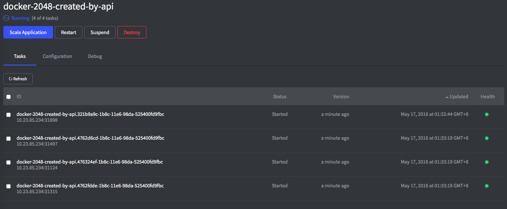

读者甚至可以停止掉 `10.23.85.234` 上的 mesos-slave 进程来验证，看看 marathon 会不会在其它结点上启动 `docker-2048` 的运行实例。