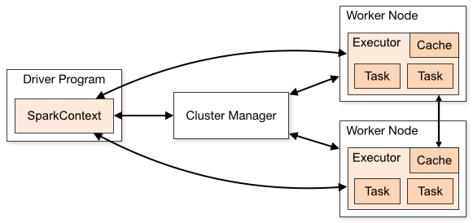

# Spark 简介

Spark 是一个快速、通用的大数据处理引擎。在速度上，Spark 宣称和
Hadoop 相比，有百倍的提升，得益于其基于内存的计算模型；但是，即使使用磁盘，
也有十倍的速度提升。

Spark 支持多种高级编程语言，如：Java, Scala, Python, R
等；并且提供了许多高级操作符，大大降低用户编写 Spark 任务的难度。

## Spark 集群模型

Spark 可以单独以集群的方式运行，也可以运行在 Mesos, YARN 之上。Spark
包含以下几种组件。

Cluster Manager 扮演集群资源管理者，例如：Mesos, YARN，或者是 Spark
本身；Driver Program 负责和 Cluster Manager
协调，申请资源，并且调度根据资源调度任务到相应的 Worker Node 上。Executor
负责启动具体的任务进程，并且实现和 Driver Program 之间的协调，完成任务的管理。

这一点和前面介绍的 Marathon 和 Chronos 不一样，Marathon 和 Chronos
对任务都是不可知的，它们实际上只对任务的状态感兴趣，完全不介入任务的逻辑。
而 Spark 是一个大数据处理框架，它需要切割，组装任务，提供任务间缓存等。
