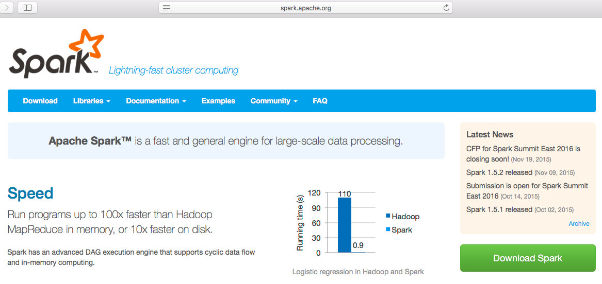
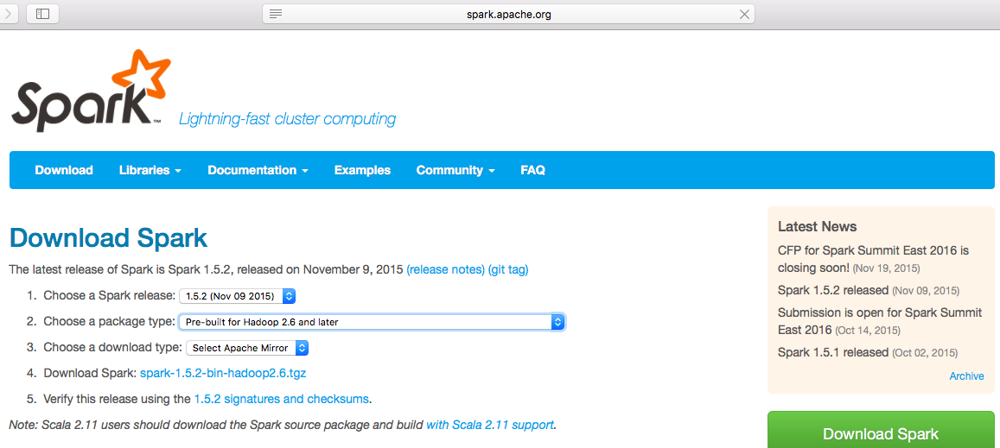
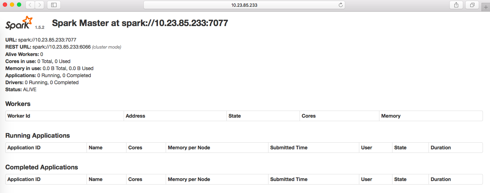
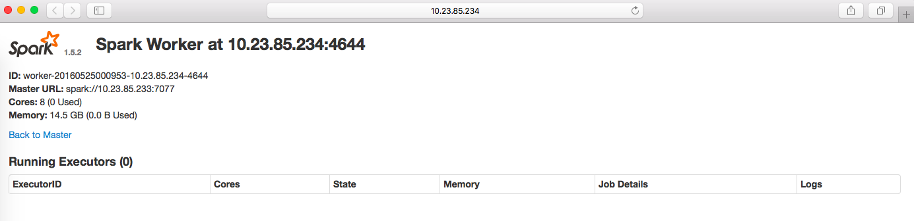
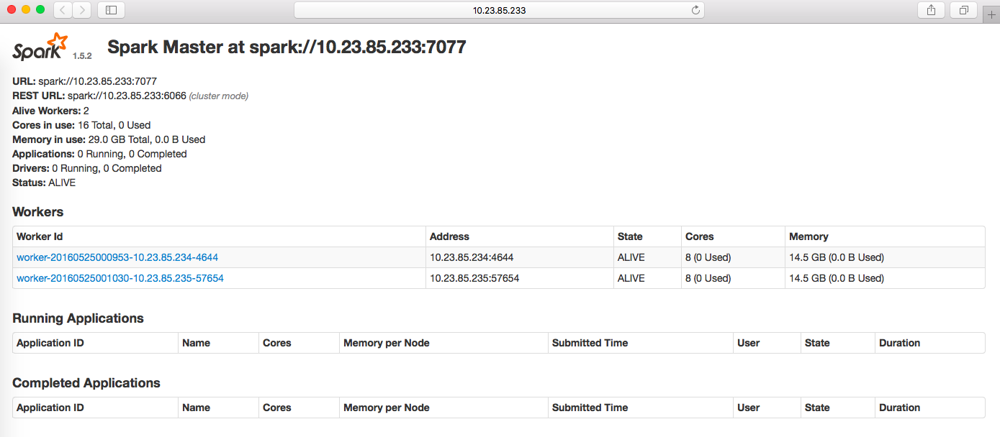
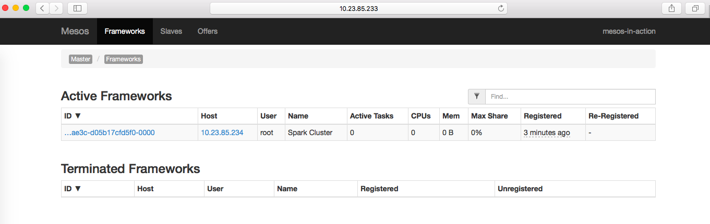
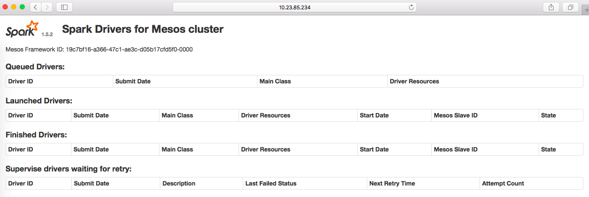

# 搭建Spark服务

Spark 可以以多种方式运行，最简单的为本地运行方式，适合于开发测试；还可以以 Spark
集群的方式运行；运行在 Mesos 或者 YARN 上。

这里将以两种方式搭建 Spark 服务：集群方式和 Mesos 方式。

## Spark 集群

在生产环境中搭建 Spark 服务，最简单的应该就是以独立 Spark 集群的方式提供 Spark
服务，因为这种方式更简单，不用处理与其它框架整合，例如：Mesos 和 YARN，
然后不可避免的还需要和其它计算框架共享集群。

在开始之前，首先下载 Spark，在编写本书之际，Spark 最新的稳定版本是 1.5.2，可以从
Spark 官网上下载，如下图所示：



点击页面中的 `Download Spark` 后，跳转到下载页面，如下图所示：



由于 Spark 使用了 Hadoop client 来访问 HDFS，所以 Spark 需要基于 Hadoop 来构建，
Spark 下载页面提供了多种下载选择：

  - 源代码
  - 不包含 Hadoop 的可执行文件
  - 针对各个特性 Hadoop 版本的可执行文件，例如：Hadoop 2.6 及更新版本

这里下载 `Pre-built for Hadoop 2.6 and later`，下载的文件名为：`spark-1.5.2-bin-hadoop2.6.tgz`，

为了启动集群，需要将 Spark 部署到各个结点中，Spark 集群中只有一个控制结点，
其余均为计算结点。

这里依然假设有 3 台服务器 A, B, C 用来搭建 Spark 集群，其中 A 将作为 Spark
控制结点，运行 Spark master 进程，而 B 和 C 将作为计算节点，运行 Spark worker
进程。

将下载好的 spark-1.5.2-bin-hadoop2.6.tgz 复制到 3 台服务器的 /opt/spark
目录下，并且解压。

```
# mkdir -p /opt/spark
# cd /opt/spark
# tar xzf spark-1.5.2-bin-hadoop2.6.tgz
# cd spark-1.5.2-bin-hadoop2.6
# ls
bin  CHANGES.txt  conf  data  ec2  examples  lib  LICENSE  licenses  NOTICE  python  R  README.md  RELEASE  sbin
```


### Spark master

在服务器 A 上启动 Spark master 进程，如下：

```
# cd /opt/spark/spark-1.5.2-bin-hadoop2.6
# ./sbin/start-master.sh
starting org.apache.spark.deploy.master.Master, logging to /opt/spark/spark-1.5.2-bin-hadoop2.6/sbin/../logs/spark-root-org.apache.spark.deploy.master.Master-1-10.23.85.233.out
```

Spark master 进程默认会监听本地地址的以下端口：

  - `8080`, Spark master web 用户界面，可以用浏览器查看
  - `7077`, Spark master 服务端口，worker 进程将和 master
    进程通过此端口建立连接

注意：如果读者在这台机器上启动了 Marathon 或者 Chronos 占用了 8080 端口，需要在启动前使用环境变量修改端口号

```
# EXPORT SPARK_MASTER_WEBUI_PORT=8081
# ./sbin/start-master.sh
```

同样，也可以使用环境变量 `SPARK_MASTER_PORT` 修改默认的监听端口 7077。

现在，打开浏览器，指向本地地址的 8080 端口，将可以看到 Spark
集群的运行情况，如下图所示：



从 Spark master web 用户界面，可以看到以下几方面的信息：

  - 基本信息：URL，REST URL，Alive Workers 等
  - Works：当前的 work
  - Running Applications：正在运行的应用
  - Completed Applications：已经完成的应用

可以看到，目前集群中还没有任何可用的计算结点，所以也不能执行任何任务。
现在，让我们向集群中添加两个计算结点。

### Spark worker

Spark worker 结点充当 Spark 的计算节点，负责和 Spark 控制节点通信并且运行任务。
在启动了 Spark 控制节点后，现在分别在服务器 B 和 C 上执行下面的操作来启动 Spark worker 进程。

```
$ cd /opt/spark/spark-1.5.2-bin-hadoop2.6
$ ./sbin/start-slave.sh spark://10.23.85.233:7077
starting org.apache.spark.deploy.worker.Worker, logging to /opt/spark/spark-1.5.2-bin-hadoop2.6/sbin/../logs/spark-root-org.apache.spark.deploy.worker.Worker-1-10.23.85.235.out
```

`start-slave.sh` 接收一个必需的参数，指定 Spark master 运行的地址。Spark worker
在启动之后，会向 Spark master 注册自己，并且汇报可用的计算资源，默认情况下，
将汇报所有可用的 CPU 资源以及所有内存减去 1GB，例如：如果计算结点配备了 8GB
的内存，那么 Spark worker 将汇报有 7GB 可用内存，目的是为计算节点自身稳定运行预留
1GB 内存。

Spark worker 默认会监听在本地地址的 8081 端口，提供 web 用户界面，所以，
用浏览器打开 B 结点的 8081 地址，如下图所示：



从 Spark worker web 用户界面，可以了解到以下几方面信息：

  - 基本信息：ID，Master URL，核数，内存大小
  - Running Executors：正在运行的 Executors

由于这里没有运行任何任务，Running Executors 中为空。

另外，再次打开 Spark master 页面，可以看到刚才添加的 2 个 Spark worker，如下图所示：



### 启动参数配置

在上面启动 Spark master 和 worker 进程时，对于可选参数，都使用了默认值，
在大多数情况下，这都工作得非常好，但是有些时候可能需要调整一些默认参数。
下面分别是 start-master.sh 和 start-slave.sh 接受的可选参数。

#### 公共参数

start-master.sh 和 start-slave.sh 接受以下公共参数。

参数 | 默认值 | 含义
-----| ------ | ----
`-h HOST, --host HOST` | 本地所有地址 | 监听的地址，例如：10.23.85.233
`-i HOST, --ip HOST` | 本地所有地址 | 不再建议使用，建议使用 `-h 或者 --host`
`-p PORT, --port PORT` | 对于 master 来说是 7077，slave 为随机端口 | master 或 slave 和对方通信的端口
`--webui-port PORT` | 对于 master 来说是 8080, slave 是 8081 | master 或 slave web 用户界面监听的端口
`--properties-file FILE` | conf/spark-defaults.conf | 属性配置文件

#### start-master.sh 参数

除了公共参数外，start-master.sh 并没有其它特有的参数。

#### start-slave.sh 参数

除了公共参数外，start-slave.sh 还有一些特有的参数：

参数 | 默认值 | 含义
-----| ------ | ----
`-c CORES, --cores CORES` | 本机所有的 CPU | 向 master 注册的可用 CPU 核数
`-m MEM, --memory MEM` | 本机所有的内存减去 1GB | 向 master 注册的可用内存
`-d DIR, --work-dir DIR` | SPARK_HOME/work | 本地工作目录

例如，我们可以修改 `--cores`, `--memory` 为本机预留更多的资源，以便计算结点自身更加稳定。
只需要在启动 `start-slave.sh` 时指定即可，例如：

```
$ ./sbin/start-slave.sh --cores 7 --memory 14G spark://10.23.85.233:7077
```

### 集群辅助脚本

除了以 `start-master.sh`, `start-slave.sh` 分别启动 master 和 slave
进程外，Spark 还提供了一次性启动或停止集群的方式，包括以下脚本，
它们都位于 Spark 的 `sbin` 目录下。

  - start-slaves.sh, 在所有 `conf/slaves` 文件中指定的计算节点上启动
    slave 进程
  - start-all.sh, 启动 master 和所有 slave 进程
  - stop-slaves.sh - 在所有 `conf/slaves` 文件中指定的计算节点上停止 slave 进程
  - stop-all.sh - 停止整个集群，包括 master 和 slave 进程

这些脚本都通过 SSH 的方式来工作，所以需要事先在其它结点上配置好基于公钥认证的 SSH 登陆配置。
详细配置方法可以参考本章开始。

### 高可用性

Spark 集群的高可用性包含两方面：Spark master 的高可用性和 Spark worker
的高可用性。

Spark worker 的高可用性通过将运行在其上的任务转移到其它结点来实现，所以 Spark
本身即实现了 worker 的高可用性。

而 Spark master 在整个集群中只有一个，所以是一个单点故障，
从而需要借助其它方式来实现 master 的高可用性。Spark 提供了两种方式：

  - 基于 ZooKeeper
  - 基于本地文件

#### 基于 ZooKeeper

在前面的章节已经介绍过 ZooKeeper 的基础知识，以及怎样搭建 ZooKeeper 服务。
而且包括：Mesos, Marathon, Chronos 都无一例外的使用了 ZooKeeper，Spark
也不例外，使用 ZooKeeper 作为其 master 高可用性方案也是首选。

和 Marathon, Chronos 类似，Spark master 也可以将集群元数据存储在 ZooKeeper
之中，以便在重新启动，或者其它 master 被选举为 Leader 时重新加载数据，
从而继续提供服务。

所以，基于 ZooKeeper 实现 Spark master 的高可用性非常容易理解：
在不同机器上以相同的配置启动多个 Spark master 进程，都注册到同一个 ZooKeeper
服务中即可。相关配置如下：

  - spark.deploy.recoveryMode, 设置为 `ZOOKEEPER`
  - spark.deploy.zookeeper.url, 设置 ZooKeeper 集群地址
  - spark.deploy.zookeeper.dir, ZooKeeper 中用来存储数据的目录，默认为 `/spark`

这些参数都通过 SPARK_DAEMON_JAVA_OPTS 来设置，这个变量可以在 conf/spark-env.sh
中设置。例如：

```
$ cd /opt/spark/spark-1.5.2-bin-hadoop2.6
$ cp conf/spark-env.sh.template conf/spark-env.sh
```

默认这个文件中没有开启任何配置，所以在这个文件中添加如下一行来配置上面的参数。

```
SPARK_DAEMON_JAVA_OPTS="-Dspark.deploy.recoveryMode=ZOOKEEPER -Dspark.deploy.zookeeper.url=10.23.85.233:2181,10.23.85.234:2181,10.23.85.235:2181
```

注意，需要修改所有 Spark 控制结点上的配置。同时，由于现在启动了多个 Spark
master 进程，当当前作为 Leader 的 master 故障时，为了能够让 worker
能够自动注册到新的 Leader 结点，worker 在启动时需要同时指定所有 Spark
master。如下：

```
./sbin/start-slave.sh spark://host1:port1,host2:port2
```

如果我们在服务器 A 和 B 上启动了 Spark master，那么可以以下面的方式启动 worker

```
./sbin/start-slave.sh spark://10.23.85.233:7077,10.23.85.234:7077
```

#### 基于本地文件

Spark master 除了能够将集群元数据存储在 ZooKeeper
之外，还可以将数据存储在本地文件，只需要配置以下两个参数：

  - spark.deploy.recoveryMode, 设置为 FILESYSTEM
  - spark.deploy.recoveryDirectory, 设置为一个本地目录

和基于 ZooKeeper 方式一样，通过设置 conf/spark-env.sh 文件中的
SPARK_DAEMON_JAVA_OPTS 变量即可。

基于本地文件方式的高可用性假设本地文件系统足够可靠，并且能够及时重新启动 Spark
master 进程。所以，这种方式本质上不能称作高可用性，也不推荐在生产环境中使用。
因为首先本地文件并不是可靠的，硬件可能损坏，文件系统可能损坏，操作系统也可能损坏，
所以很可能需要花很长一段时间来恢复服务。

当然，为了避免本地文件系统的不可用性，读者也可以使用网络文件系统，
但这或许会引入性能问题或者其它复杂度的问题。所以，总是推荐在生产环境中使用基于
ZooKeeper 的高可用性实现方式。

## Spark on Mesos

上面介绍了 Spark 以独立的方式搭建集群，Spark 还可以和 Mesos 结合，运行在 Mesos 集群之上。

Spark 最早出现是在 Mesos 的论文里，作为一个运行在 Mesos 之上的框架，
用来证明 Mesos 是一种可以有效管理集群，且提高集群综合利用率的方案。
所以，不言而喻，Spark 可以运行在 Mesos 之上。

Spark 可以以两种方式运行在 Mesos 之上：

  - Client 模式
  - Cluster 模式

在 Client 模式下，Spark 以 mesos scheduler 的方式直接和任务耦合在一起。直接运行在提交任务的本地节点上。这种方式比较适合提交任务的节点和 Mesos 集群的计算节点相邻，或者位于同一个子网中，以便 spark driver 和 executor 之间能够保证高速通信。

而在 Cluster 模式下，Spark scheduler
不再和任务耦合在一起，任务是从客户端提交的，spark scheduler(driver) 运行在 Mesos 集群中。

这里只介绍 Cluster 模式。

### 启动 Spark Scheduler

假设 Mesos 线上服务为
`zk://10.23.85.233:2181,10.23.85.234:2181,10.23.85.235:2181/mesos`。

将 spark-1.5.2-bin-hadoop2.6.tgz 复制到 10.23.85.234 结点上，
然后启动 Spark Scheduler，命令如下：

```
$ tar xzf spark-1.5.2-bin-hadoop2.6.tgz
$ cd spark-1.5.2-bin-hadoop2.6
$ ./sbin/start-mesos-dispatcher.sh --master mesos://zk://10.23.85.233:2181,10.23.85.234:2181,10.23.85.235:2181/mesos
```

`start-mesos-dispatcher.sh` 脚本接受一个参数 `--master`，指明 mesos
集群的地址，这里的格式为 `mesos://<path>`，其中 `mesos://` 为地址前缀，`<path>`
为 mesos 集群地址，这里可以是单个 mesos master 地址也可以是 mesos 集群在
ZooKeeper 中的地址，这里我们使用了在上一章中搭建了 mesos 生产集群。

启动了 Spark Scheduler 之后，可以从 Mesos master web 用户页面看到其已经注册了，
如下图所示：



用浏览器打开 `http://10.23.85.234:8081`，可以看到如下 spark 页面：



现在，用户可以通过 Spark 客户端向 Spark Scheduler 提交任务了，只需要指明 Spark
Scheduler 的服务地址即可，这里为：`mesos://10.23.85.234:7077`。

### 运行模式

Spark 在 Mesos 上可以有两种运行模式：

  - `fine-grained`
  - `coarse-grained`

fine-grained 为默认模式，在该模式下，每个 Spark 提交在 Mesos
上都会注册一个框架，而该次提交内部的每个任务则会通过 Mesos 来调度，
调度每个任务都需要获取资源、调度任务、执行、完成任务释放资源。

这种调度方式的优点是 Spark 各个提交中之间动态共享资源，并且和其它 Mesos
框架也是动态共享资源，缺点是单次任务都需要经过完整的 Mesos 调度周期，调度较慢；
所以，不太适合用于低延时的任务，例如，交互式查询等。

coarse-grained 则是另一种粒度更粗的方式，这种方式只会在有资源的 Mesos
计算结点上启动 Worker，而后续任务的调度则由 Spark Scheduler 直接将任务分发给
Worker，从而避免完整的 Mesos 调度周期。所以，coarse-grained 方式调度更快，
但是会长期占用资源。

运行模式可以通过 SparkConf 的健 `spark.mesos.coarse` 来配置，值为
`true|false`。需要注意的是：`coarse-grained` 模式默认会使用所有 Mesos 分配的
Offer，所以为了避免占用过多的资源，总是应该设置 SparkConf 的 `spark.cores.max`
为一个合理值。

### 使用 Docker

Spark 支持启动 Docker 容器来运行 Spark 任务，这要求 Mesos 版本等于或高于
0.21.0，因为 Mesos 在 0.21.0 中引入了对 Docker 的支持。如果要使用 Docker 容器来执行 Spark 任务，需要再 Docker 镜像中配置好
Spark 执行环境。可以通过 SparkConf 的 `spark.mesos.executor.docker.image`
来配置要使用的镜像。

### Spark on Mesos 配置

Spark 具有非常高的可配置性，所以也有非常多的配置项，这里不再介绍 Spark
通用的配置项，读者可以参考官方文档或者其它 Spark 书籍。

这里将介绍特定于 Spark on Mesos 的配置，如下表所示：

配置项 | 默认值 | 含义
------ | ------ | -----
`spark.mesos.coarse` | false | 是否使用 `coarse-grained` 模式运行
`spark.mesos.extra.cores` | 0 | 只在 `coarse-grained` 模式下使用，表示使用额外的多少核CPU 来启动 worker，但是所有 worker 的 CPU 之和不能超过 `spark.cores.max`
`spark.mesos.mesosExecutor.cores` | 1.0 | 只在 `fine-grained` 模式下使用，表示 Spark Executor 额外使用的 CPU 核
`spark.mesos.executor.docker.image` | 空 | 启动 Spark Executor 使用的 Docker 镜像
`spark.mesos.executor.docker.volumes` | 空 | 启动 Spark Executor 容器时挂载的卷
`spark.mesos.executor.docker.portmaps` | 空 | 启动 Spark Executor 容器时映射的端口
`spark.mesos.executor.home` | Spark Driver 中设置的 SPARK_HOME | 当没有设置 `spark.executor.uri` 时，Spark 需要从该值中找到 Executor 目录并启动 Executor
`spark.mesos.executor.memoryOverhead` | `spark.executor.memory` 的十分之一，最小为 384MB | 每个 Executor 额外的内存，为了保证不占用 task 的内存
`spark.mesos.uris` | 空 | uris 是 Mesos 提供的初始化运行环境的功能，在启动任务之前，会将 uris 指定的资源下载到任务启动目录中
`spark.mesos.principal` | 空 | Mesos 认证需要的 principal
`spark.mesos.secret` | 空 | Mesos 认证需要的 secret
`spark.mesos.role` | * | Spark Scheduler 使用的角色，角色是 Mesos 用来分配计算资源的一种方法
`spark.mesos.constraints` | 空 | 根据 Mesos 计算节点的标签来设置过滤规则，任务将只被调度到符合条件的计算节点上
