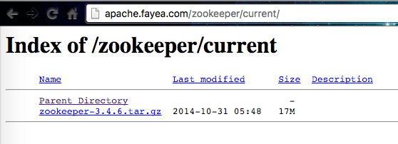
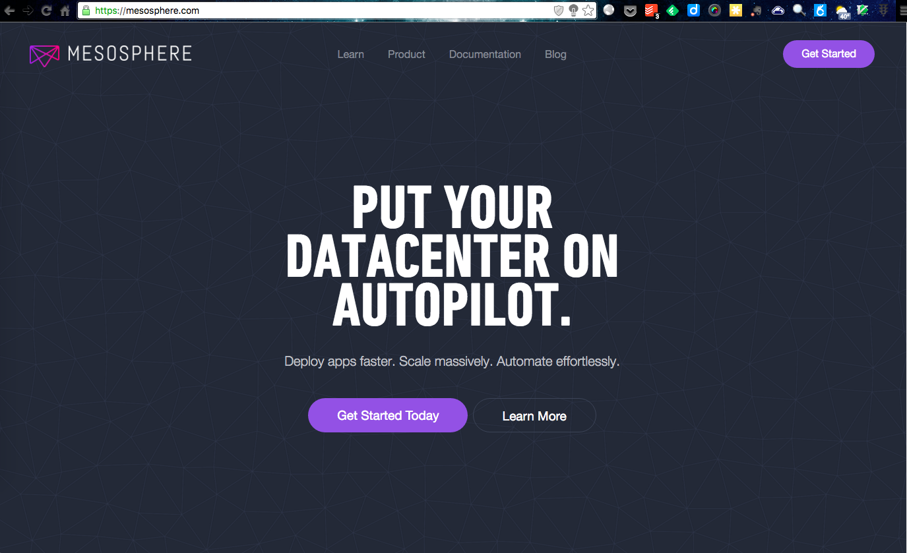
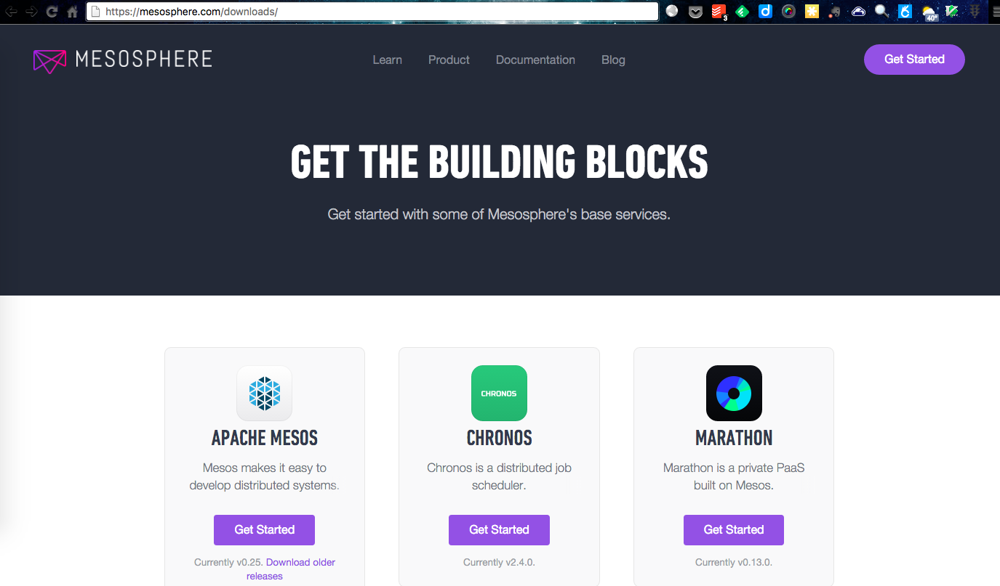
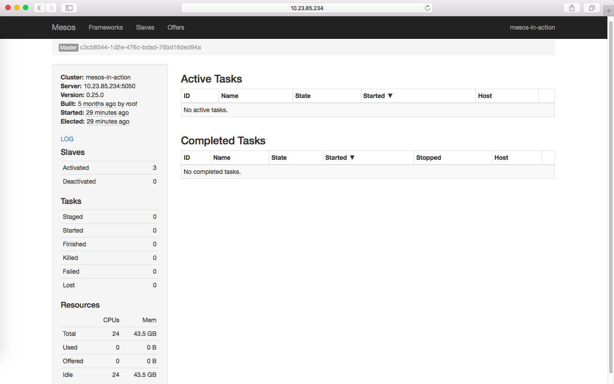
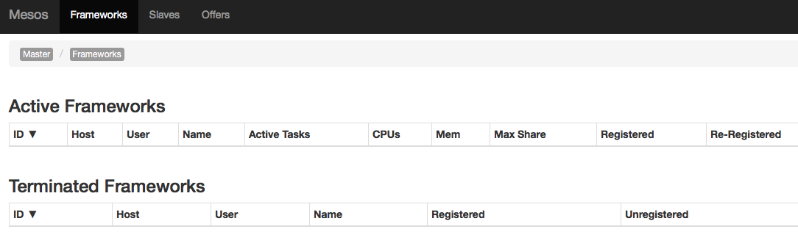
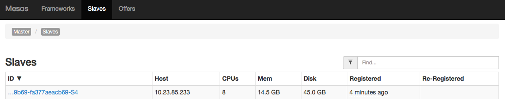
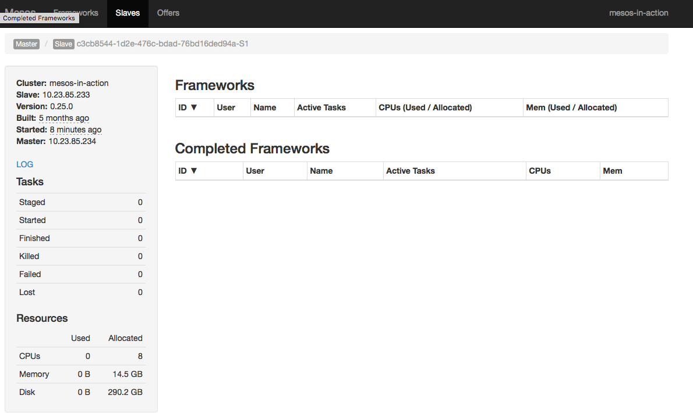
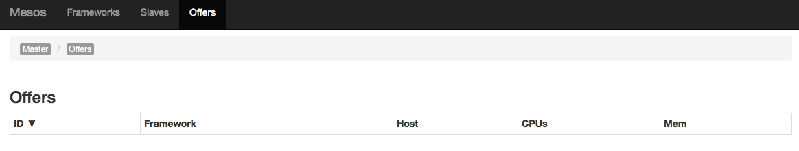
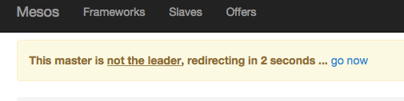
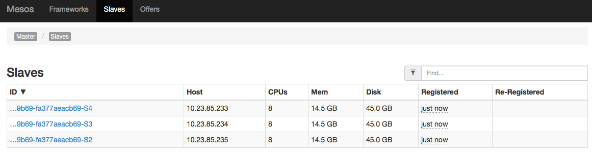

# 搭建一个 Mesos 集群

实践出真知，学习 Mesos 也不例外，这里将介绍怎样搭建一个最小生产集群。
由于 Mesos 目前仅提供对 Linux 版本，所以这里将介绍怎样在 Linux 环境下搭建 Mesos 集群；所以，读者需要有一定的 Linux 基础知识。
另外，考虑到在生产环境中主要以 RHEL/CentOS 为主，所以本节内容都基于最新的 CentOS 7 稳定版本。

## 准备工作

在开始搭建 Mesos 集群之前，需要准备以下环境。

  - 3 台 Intel x86_64 架构的计算机
  - 计算机中安装了 CentOS 7.1 操作系统
  - 计算机至少配备了 2core, 4GB 内存

如果准备 3 台物理机有难度，虚拟机也是可以的；Linux 环境中最常用的桌面虚拟化软件例如：VirtualBox 都非常好用。

注：介绍怎样准备虚拟机，怎样安装 CentOS 7.1 操作系统超出了本书的范围，不再赘述。

假设 3 台计算机分别为：

  - A, IP 10.23.85.233
  - B, IP 10.23.85.234
  - C, IP 10.23.85.235

上面的 IP 地址其实不重要，只需要读者的 3 台计算机具有互相可访问的 IP 地址即可（当然，最好是局域网，在同一个子网更好，能够保证网络质量）。

下面我们将在这三台计算机中搭建一个 Mesos 集群，由于 Mesos 是一个分布式的集群服务，所以要提供稳定高可用的服务，3 个 mesos-master 结点是必不可少的，所以这里不再介绍只要一个节点的 mesos 服务；同时，为了降低演示的复杂度，3 台计算机节点将同时运行 mesos-master 和 mesos-slave 进程，也就是同时充当控制节点和计算节点的角色。

在开始之前，我们选定 A 作为操作机，大部分的操作都将在 A 上完成，在 A 上通过 SSH
连接到 B 和 C 来完成部署，所以下面将介绍下怎样搭建 SSH 环境。

### 搭建 SSH 环境

SSH(Secure Shell) 顾名思义是一种安全 Shell 技术，通过 SSH，可以拿到远程主机的 Shell，就像操作本机一样。

SSH 是一项非常常用的功能，所以大部分 Linux 发行版都默认提供了 SSH 客户端，CentOS 也不例外；所以，这里只介绍怎样在 CentOS 7 上搭建 SSH 服务，搭建了服务之后，就可以从其它主机上通过 SSH 客户端获取本机的安全 Shell 了。

还是以 A, B, C 三个节点为例，由于这里使用 A 作为控制机，所以需要在 B 和 C 上搭建 SSH 服务
，并且配置好账号以便能够允许用户从 A 上获取 B 和 C 的安全 Shell。

这里以 B 为例介绍怎样配置 SSH 服务。

由于要执行一些特权操作，所以这里直接切换到 root 用户，所以，一定要小心操作，
以免损坏系统。

```
$ su - root
Password:
```

在输入 root 用户密码后，即获得了一个 root 用户登录 Shell，登录 Shell 和非登录 Shell（su root）的不同在于 Shell 初始化的不同，具体细节这里不再介绍。

在获得了 root Shell 之后，就可以安装软件了，下面来安装 SSH 服务器，
输入如下命令：

```
# yum clean all
# yum makecache
# yum install -y openssh-server
```

上面 3 条命令：

  - 第一条命令删除所有 yum cache，以免用户修改过 yum repo 等信息，导致错误
  - 第二条命令重新构建 yum cache
  - 最后一条命令安装 openssh-server 包，`-y` 参数表示不用提示用户，直接安装

安装完成后，使用下面的命令启动 SSH 服务：

```
# systemctl start sshd.service
```

如果想要设置 SSH 服务开机自动启动，可以使用如下命令：

```
# systemctl enable sshd.service
```

如果读者使用过 CentOS 6，应该会发现，这里启动服务不再使用 `service` 或者 `initctl` 命令，而是使用 `systemctl`。

systemctl 是 systemd 的控制命令，CentOS 从 7 版本开始，使用 systemd 替换了原有的 sysvinit 及其它相关软件。

启动后，可以使用 `systemctl status` 命令来查看 SSH 服务（名字为 sshd.service）的状态。

```
# systemctl status sshd.service
sshd.service - OpenSSH server daemon
   Loaded: loaded (/usr/lib/systemd/system/sshd.service; enabled)
   Active: active (running) since Mon 2015-11-16 17:30:12 CST; 2 weeks 5 days ago
 Main PID: 986 (sshd)
   CGroup: /system.slice/sshd.service
           └─986 /usr/sbin/sshd -D
... 省略部分输出 ...
```

开启了 SSH 服务后，就可以从其它机器上连接 SSH 服务的专有 22 端口了。但是，要成功登陆，还需要配置好用户账号。

默认情况下，SSH 服务允许使用 root 账号通过密码登陆，所以，只需要设置了 root 账号密码即可通过 SSH 登陆，如下为 /etc/ssh/sshd_config 的相关配置：

```
#PermitRootLogin yes
```

为了简单，这里使用 root 账号密码登陆，如果用户需要了解怎样配置通过 SSH 密钥登陆，可以参考相关文档配置。

下面从计算机 A 登陆 B，在 A 上执行下面命令：

```
$ ssh -l root 10.23.85.234
```

在输入 B 机器中 root 账号的密码后，登陆成功了！接下来在这个会话中执行的任何命令都和在计算机
B 上执行的效果一样（当然，除了登出）。

上面的命令中 `-l` 参数表示要登陆的账号用户名，而 10.23.85.234 则是远程主机 IP 地址。

在配置好了计算机 B 的 SSH 服务后，以同样的方式配置好 C。搭建 SSH 服务只是为了搭建 Mesos 集群做准备，接下来将要介绍怎样搭建 ZooKeeper 集群服务。

## 搭建 ZooKeeper 集群

ZooKeeper 是一个分布式基础服务软件，最初作为 Hadoop 项目的一个子项目，目前已经成为 Apache 软件基金会的顶级项目。Mesos 依赖 ZooKeeper
提供的服务，所以在搭建 Mesos 集群之前，首先需要搭建 ZooKeeper 集群。

通过后面的章节可以了解到，不仅 Mesos, 包括后面将要介绍的 Marathon, Chronos, Storm 等项目也都使用了
ZooKeeper 服务。

首先，我们需要到 ZooKeeper 项目主页（http://zookeeper.apache.org/）上下载
ZooKeeper，如下图所示：


这里我们下载目前最新的稳定版本：3.4.6，如下图所示：



可以直接通过浏览器点击下载链接来下载，或者，也可以通过 wget 来下载，假设在 A 节点上：

```
$ cd ~/Downloads
$ wget http://apache.fayea.com/zookeeper/current/zookeeper-3.4.6.tar.gz
```

要提供稳定可靠的 ZooKeeper 服务，至少需要 3 个 ZooKeeper 服务实例，这里将在 A, B
和 C 上搭建一个由 3 个 ZooKeeper 服务实例组成的高可用 ZooKeeper 服务。

**下面的操作如非特别说明，都在节点 A 上完成。**

首先，解压下载好的 ZooKeeper 压缩包。

```
$ cd ~/Downloads
$ tar -xzf zookeeper-3.4.6.tar.gz
```

上面的解压命令在正确解压时，不会输出任何内容，这也是 Linux
的一个设计哲学：没有消息即是好消息。所以，Linux 会尽量不去打扰用户。

解压完成后，首先来看一下怎样启动一个只有一个 ZooKeeper 实例的服务，只有一个实例也就意味着：一旦这个实例退出，服务就变得不可用了。

### 启动一个 ZooKeeper 服务

进入解压后的 ZooKeeper 目录，这里需要留意的有以下几个目录：

  - `conf`, 配置文件目录
  - `bin`, 可执行文件，脚本目录

在启动 ZooKeeper 之前，首先需要一个可用的配置文件，ZooKeeper
自带一个示例配置文件，我们可以在示例配置文件基础上修改自己的配置。

复制实例配置文件：

```
$ cd ~/Downloads/zookeeper-3.4.6
$ cp conf/zoo_sample.cfg conf/zoo.cfg
```

其实，无需任何修改，就可以启动单个实例 ZooKeeper 服务了：

```
$ ./bin/zkServer.sh start
JMX enabled by default
Using config: /home/chengwei/zookeeper-3.4.6/bin/../conf/zoo.cfg
Starting zookeeper ... STARTED
```

上面的命令很简单，最后会输出命令执行的结果，STARTED 表示启动 ZooKeeper 成功。

另外，可以使用 zkServer.sh status 命令来查看 ZooKeeper 服务的当前状态。

```
$ ./bin/zkServer.sh status
JMX enabled by default
Using config: /home/chengwei/zookeeper-3.4.6/bin/../conf/zoo.cfg
Mode: standalone
```

可见，现在 ZooKeeper 服务已经启动，并且可以提供服务了，在没有修改配置文件的情况下，默认 ZooKeeper 运行在 standalone 模式，也就是非高可用模式。

下面我们简单的测试一下，使用 zkCli.sh 可以连接 ZooKeeper 服务，
不指定服务地址将默认连接本地服务。

如下所示（省略了部分输出）：

```
$ ./bin/zkCli.sh
Connecting to localhost:2181
2015-12-05 18:35:30,100 [myid:] - INFO  [main:Environment@100] - Client environment:zookeeper.version=3.4.6-1569965, built on 02/20/2014 09:09 GMT
2015-12-05 18:35:30,102 [myid:] - INFO  [main:Environment@100] - Client environment:host.name=mesos-master-dev021-cqdx.qiyi.virtual
2015-12-05 18:35:30,103 [myid:] - INFO  [main:Environment@100] - Client environment:java.version=1.7.0_75
2015-12-05 18:35:30,104 [myid:] - INFO  [main:Environment@100] - Client environment:java.vendor=Oracle Corporation
2015-12-05 18:35:30,104 [myid:] - INFO  [main:Environment@100] - Client environment:java.home=/usr/lib/jvm/java-1.7.0-openjdk-1.7.0.75-2.5.4.2.el7_0.x86_64/jre
... 省略了部分输出 ...
2015-12-05 18:35:30,106 [myid:] - INFO  [main:ZooKeeper@438] - Initiating client connection, connectString=localhost:2181 sessionTimeout=30000 watcher=org.apache.zookeeper.ZooKeeperMain$MyWatcher@65297ad9
Welcome to ZooKeeper!
... 省略了部分输出 ...
[zk: localhost:2181(CONNECTED) 0]
```

连接到 ZooKeeper 服务后，会打开一个命令 shell，可以使用 `help`
命令查看支持的命令以及各个命令的用法。

```
[zk: localhost:2181(CONNECTED) 0] help
ZooKeeper -server host:port cmd args
        connect host:port
        get path [watch]
        ls path [watch]
        set path data [version]
        rmr path
        delquota [-n|-b] path
        quit
        printwatches on|off
        create [-s] [-e] path data acl
        stat path [watch]
        close
        ls2 path [watch]
        history
        listquota path
        setAcl path acl
        getAcl path
        sync path
        redo cmdno
        addauth scheme auth
        delete path [version]
        setquota -n|-b val path
```

下面我们测试一下使用 ZooKeeper 来存取简单的键值对。

```
[zk: localhost:2181(CONNECTED) 1] create /book mesos-in-action
Created /book
[zk: localhost:2181(CONNECTED) 2] ls /
[book, zookeeper]
[zk: localhost:2181(CONNECTED) 3] get /book
mesos-in-action
cZxid = 0xe
ctime = Sat Dec 05 18:51:37 CST 2015
mZxid = 0xe
mtime = Sat Dec 05 18:51:37 CST 2015
pZxid = 0xe
cversion = 0
dataVersion = 0
aclVersion = 0
ephemeralOwner = 0x0
dataLength = 15
numChildren = 0
```

ZooKeeper 远远不是用来存取键值这么简单，它的目标是提供分布式软件开发中常见的问题，
常用的功能，例如：一致性配置存储，领导选举，分布式锁等。

在基本了解了怎样搭建一个单实例的 ZooKeeper 服务之后，我们来看看怎样搭建由 3 个
ZooKeeper 实例组成的高可用服务。在生产环境中，推荐至少搭建 3 个 ZooKeeper 实例，
由它们组成一个高可用的服务，避免因一个服务实例故障而导致服务不可用。

由于 ZooKeeper 作为分布式环境基础服务，所以一旦 ZooKeeper
服务不可用，那么基于它的服务也就不可用了，例如这里将要介绍的 Mesos，以及后续将要介绍的 Marathon，Chronos 等。

### 搭建高可用 ZooKeeper 服务

这里将搭建由 3 个 ZooKeeper
实例组成的高可用服务，前面我们已经搭建了一个单实例服务。简单的说，
高可用服务首先需要 3 个实例，并且需要分别位于不同的机器上，如果是虚拟机，
那么虚拟机也要分别位于不同物理机上，如果需要更严格的高可用，可以要求物理机不要位于同一机架，
交换机。

这里我们以前面的 3 个 A, B, C 节点为例，分别在上面启动一个 ZooKeeper 实例，
并且让它们组成一个服务。

我们首先在 A 上启动 ZooKeeper 实例，方法和上一节搭建单个 ZooKeeper
实例方法类似，需要有两点修改。

首先，需要修改配置文件 `conf/zoo.cfg`，将下面几行添加到 `conf/zoo.cfg` 末尾。

```
server.1=10.23.85.233:2888:3888
server.2=10.23.85.234:2888:3888
server.3=10.23.85.235:2888:3888
```

上面 3 行配置分别指定了 3 个 ZooKeeper 实例的地址，键的格式为：`server.<N>`，
其中数字 N 表示第几个实例，合法值为从 1 到 255。值的格式为：`host:port1:port2`，
host 表明这个实例运行的地址，port1(2888) 为 ZooKepper leader 和其它 ZooKeeper 实例之间通信的端口，
port2(3888) 为各个实例进行 leader 选举时所用端口。

由于上面的配置文件在每个 ZooKeeper 实例中都是一样的，ZooKeeper 并不会自己检测 IP 来确定自己是第几个 server，所以，还需要单独配置。

配置方法是在配置文件中指定的 `dataDir` 目录中创建一个 myid
文件，并且其中只包含一个数字，这个数字即是配置文件中 `server.<N>` 中的 `<N>`。

例如：A 机器 10.23.85.233 在配置文件中为 server.1，那么就需要在 `dataDir`
中创建一个 myid 文件，并且内容只包含数字 1。

默认的 zoo.cfg 中的 `dataDir` 目录为 /tmp/zookeeper。在 Linux
FHS(/tmp/zookeeper) 标准中，/tmp 是一个挂载在内存设备中的临时目录，
数据在机器关机后丢失，所以在生产环境中，记住修改此配置，这里我们修改 dataDir 为 /var/zookeeper。

在熟悉了配置方式后，在 A, B, C 节点上，在 `conf/zoo.cfg` 中都添加同样的 3
行配置。

```
server.1=10.23.85.233:2888:3888
server.2=10.23.85.234:2888:3888
server.3=10.23.85.235:2888:3888
```

然后，分别在 A, B, C 上创建一个文件 `/var/zookeeper/myid`，值分别为 1, 2, 3。
以在 A 机器上操作为例：

```
$ mkdir /var/zookeeper
$ echo 1 > /tmp/zookeeper/myid
```

在 3 台机器上配置完成后，就可以启动 ZooKeeper 实例了，以 A 节点为例：

```
$ ./bin/zkServer.sh start
JMX enabled by default
Using config: /home/chengwei/Downloads/zookeeper-3.4.6/bin/../conf/zoo.cfg
Starting zookeeper ... STARTED
```

如果此时使用 `status` 命令查看。

```
[chengwei@mesos-master-dev021-cqdx zookeeper-3.4.6]$ ./bin/zkServer.sh status
JMX enabled by default
Using config: /home/chengwei/Downloads/zookeeper-3.4.6/bin/../conf/zoo.cfg
Error contacting service. It is probably not running.
```

会发现提示：`Error contacting service. It is probably not running.`，
这是因为 `status` 命令会尝试连接服务，并且从连接信息中判断服务是否可用，
而由于我们将 ZooKeeper 实例配置成了高可用服务，所以单单只启动一个 ZooKeeper
实例是不能提供服务的，所以也就显示了上面的错误提示。

接下来，在 B 节点上启动 ZooKeeper 实例：

```
$ ./bin/zkServer.sh start
JMX enabled by default
Using config: /home/chengwei/Downloads/zookeeper-3.4.6/bin/../conf/zoo.cfg
Starting zookeeper ... STARTED
```

现在，再次使用 `status` 在 A 上查看 ZooKeeper 服务状态。

```
$ ./bin/zkServer.sh status
JMX enabled by default
Using config: /home/chengwei/Downloads/zookeeper-3.4.6/bin/../conf/zoo.cfg
Mode: follower
```

可以看到它的状态已经正常了，并且处于 `follower`
模式（注意：在读者的实践中，模式也有可能为 `leader`），那么，现在再来看看 B
节点上的 ZooKeeper 实例状态。

```
$ ./bin/zkServer.sh status
JMX enabled by default
Using config: /home/chengwei/Downloads/zookeeper-3.4.6/bin/../conf/zoo.cfg
Mode: leader
```

现在，ZooKeeper 服务已经可以提供服务了，但是，为了保证服务的高可用性，需要在 C
节点上也启动 ZooKeeper 服务实例；这样，A, B, C
中任意一个服务实例故障，都不会影响到 ZooKeeper 服务的可用性。

当然，一旦故障，必须尽快恢复，否则，另一个实例再发生故障，那么服务就不可用了，对于由 N 个实例组成的 ZooKeeper 服务，任意时间只要有大于 N/2 个实例正常，则可提供服务。

在搭建了 ZooKeeper 服务之后，就可以搭建 Mesos 生产集群了，其实，如果不是生产集群，Mesos 也可以不使用 ZooKeeper 服务。

## 搭建 Mesos 集群

在介绍了怎样搭建 ZooKeeper 服务后，下面来看看怎样搭建一个 Mesos 集群，和搭建
ZooKeeper 服务类似，我们分两步进行：首先介绍搭建一个单 master/slave 的伪集群，
然后搭建一个多 master（高可用) 多 slave 的真集群。

### 搭建单 master/slave Mesos 集群

我们通过搭建单 master/slave 的 Mesos 集群，来了解一些 Mesos 基础知识，
以便能更容易理解怎样搭建一个可用于生产环境的高可用 Mesos 集群。

Mesos 虽然是托管于 Apache 软件基金会，但主要的开发者大部分来自于 Mesosphere 公司，Mesosphere 是一家基于 Mesos 的创业公司，由 Mesos 的原始作者创办，mesosphere
同时为社区提供了一些非常好的文档，软件包，并且其主要产品 DCOS(Data Center Operating System) 也是基于 Mesos 构建。这里我们将从 mesosphere 官方网站上下载
mesos RPM 包用于安装，从而免去下载源码，编译，安装。

下面是一张 mesosphere 主页的截图。



从主页上，其实是不太方便找到 Mesos RPM
包下载地址的，将页面拉倒底部，或者直接访问 `https://mesosphere.com/downloads/`，
就可以到达下载页面，如下图所示：



直接点击 Apache Mesos 的 Get Started 链接，即可查看 mesosphere 关于安装 Mesos
软件的文档。这里以在 A 节点上搭建 Mesos 单 master/slave 集群为例。

#### 安装 Mesos 软件

下载完成后，假设存放在节点 A 上的 /root/Downloads 目录下，现在就可以安装了：

```
# rpm -ivh /root/Downloads/mesos-0.25.0-0.2.70.centos701406.x86_64.rpm
warning: mesos-0.25.0-0.2.70.centos701406.x86_64.rpm: Header V4 RSA/SHA1 Signature, key ID e56151bf: NOKEY
Preparing...                          ################################# [100%]
Updating / installing...
   1:mesos-0.25.0-0.2.70.centos701406 ################################# [100%]
Created symlink from /etc/systemd/system/multi-user.target.wants/mesos-master.service to /usr/lib/systemd/system/mesos-master.service.
Created symlink from /etc/systemd/system/multi-user.target.wants/mesos-slave.service to /usr/lib/systemd/system/mesos-slave.service.
```

安装完成后，可以看到，在 /etc/systemd/system/multi-user.target.wants/ 目录中创建了两个符号链接，分别指向 /usr/lib/systemd/system/mesos-master.service 和 mesos-slave.service。

细心的读者可能已经从配置 SSH 服务一节看到，这里的输出和 `systemctl enable sshd.service` 非常类似，是的，安装完 mesos RPM 包之后，自动设置了 mesos-master 和 mesos-slave 为开机启动。

读者也可以使用 `systemctl is-enabled` 命令来验证，如下：

```
# systemctl is-enabled mesos-master mesos-slave
enabled
enabled
```

由于我们将在 A, B, C 三个节点上都启动 mesos-master, mesos-slave, 所以不用禁止它们中的任何一个。但是，在实际生产环境中，节点往往只充当一个角色，要么运行 mesos-master，要么运行 mesos-slave，所以往往需要禁止一个服务的开机启动，以禁止 mesos-slave 为例：

```
# systemctl disable mesos-slave
Removed symlink /etc/systemd/system/multi-user.target.wants/mesos-slave.service.
```

#### 配置 Mesos

安装完成后，在启动之前，我们需要进行一些必须的配置，mesos-master 和 mesos-slave 各自都有很多可配置的选项，这里不再详细介绍，读者可以参考 `--help` 或者官方文档了解。

安装完 mesos RPM 包后，可以通过下面命令查看安装的文件：

```
# rpm -ql mesos
```

这里需要注意的有几个文件：

  - /usr/lib/systemd/system/mesos-master.service, mesos-master 进程的服务配置文件，用来控制服务的启停
  - /usr/lib/systemd/system/mesos-slave.service, mesos-slave 进程的服务配置文件，用来控制服务的启停
  - /etc/default/mesos，mesos-master 和 mesos-slave 共用的配置文件
  - /etc/default/mesos-master，mesos-master 专用配置文件
  - /etc/default/mesos-slave，mesos-slave 专用配置文件
  - /etc/mesos/zk，ZooKeeper 地址配置文件，mesos-master 和 mesos-slave 共用

感兴趣的读者可以查看 mesos-master.service 和 mesos-slave.service 文件了解 mesos-master, mesos-slave 分别是被怎样启动的，然后怎样加载配置文件的，这里不再赘述。

我们知道，要启动一个高可用的 mesos 集群，需要至少 3 个 mesos-master 进程，以及 ZooKeeper 服务，接下来看下怎样配置：

**/etc/default/mesos**

/etc/default/mesos 为 mesos-master 和 mesos-slave 共用配置文件，默认配置内容如下：

```
# cat /etc/default/mesos
LOGS=/var/log/mesos
ULIMIT="-n 8192"
```

这里只有两项配置：

  - LOGS 指定 mesos 存放日志的目录
  - ULIMIT 指定 mesos 额外的 ULIMIT 配置，这里配置了可以打开的文件数为 8192

读者可以在这个文件中添加其它配置，例如：

  - GLOG_max_log_size=1024，设置日志文件大小为 1024MB
  - GLOG_stop_logging_if_full_disk=1，当磁盘满后停止写日志

需要注意的是，如果 mesos-slave 启动的进程打开的文件（Linux 中一切皆文件）太多，很可能超过 8192，此时就需要设置更大的值。

在这里，我们保持这个文件不修改即可。

**mesos-master 配置**

mesos-master 进程在启动时，会加载共用的配置文件，还会加载 mesos-master 专用的配置文件，所以非共用的配置文件，在 /etc/default/mesos-master 中配置即可。

首先来看看默认的配置都有什么：

```
# cat /etc/default/mesos-master
PORT=5050
ZK=`cat /etc/mesos/zk`
```

可以看到，这里只有两个配置项：

  - PORT，mesos-master 监听的端口，默认为 5050，不用修改
  - ZK，ZooKeeper 服务地址，默认为读取 /etc/mesos/zk 中的内容

可以看到，/etc/mesos/zk 默认配置为：

```
# cat /etc/mesos/zk
zk://localhost:2181/mesos
```

这是一个本地 ZooKeeper 服务，并且是一个 standalone 的 ZooKeeper 服务，这里简单解析下配置的格式：

  - zk://，这是 ZooKeeper 服务地址的前缀，意义类似 HTTP 协议的 http://
  - localhost:2181，这是一个 ZooKeeper 服务实例，如果有多个服务实例，则用逗号分隔，例如：ip1:port1,ip2:port2,ip3:port3
  - /mesos，这是 mesos 将要使用的存储资源，ZooKeeper 提供了类似文件系统的存储资源

所以，这里将其配置为我们在上一节搭建的 ZooKeeper 服务：

```
# cat /etc/mesos/zk
zk://191.168.1.101:2181,191.168.1.102:2181,191.168.1.103:2181/mesos
```

配置完成后，就可以启动 mesos-master 进程了，所以，实际上必须的配置非常简单，只需要配置好 ZooKeeper 服务地址即可，甚至，因为我们在 A 结点上也启动了 ZooKeeper 服务，连默认的 /etc/mesos/zk 配置文件也无需修改。

**mesos-slave 配置**

mesos-slave 和 mesos-master 类似，只是具有不同的配置选项和专有的配置文件。

```
# cat /etc/default/mesos-slave
MASTER=`cat /etc/mesos/zk`
```

可以看到，mesos-slave 的专有配置文件里，只配置了一个选项：

  - MASTER，指定 mesos-master 的服务地址

由于我们在同一个计算节点上启动 mesos-master 和 mesos-slave，所以这里不需要再配置 /etc/mesos/zk 了，已经在上面的 mesos-master 配置中配置好了。

#### 启动 Mesos 集群

配置完成后，执行下面的命令分别启动 mesos-master 和 mesos-slave
进程，这两个进程分别作为 Mesos 集群的控制结点和计算结点。

```
# systemctl start mesos-master
# systemctl start mesos-slave
```

正常情况下，上面两行命令不会有任何输出，然后，可以使用下面的命令来查看 mesos-master 或 mesos-slave 进程状态，以 mesos-master 为例：

```
# systemctl status mesos-master
● mesos-master.service - Mesos Master
   Loaded: loaded (/usr/lib/systemd/system/mesos-master.service; enabled; vendor preset: disabled)
   Active: active (running) since Sun 2016-04-03 16:53:37 CST; 2s ago
 Main PID: 13489 (mesos-master)
   Memory: 5.2M
   CGroup: /system.slice/mesos-master.service
           ├─13489 /usr/sbin/mesos-master --zk=zk://10.23.85.233:2181,10.23.85.234:2181,10.23.85.235:2181/mesos --port=5050 --log_dir=/var/log/mesos...
           ├─13499 logger -p user.info -t mesos-master[13489]
           └─13500 logger -p user.err -t mesos-master[13489]

Apr 03 16:53:37 10.23.85.233 mesos-master[13500]: I0403 16:53:37.084251 13504 group.cpp:403] Trying to create path '/mesos/log_replicas' in ZooKeeper
Apr 03 16:53:37 10.23.85.233 mesos-master[13500]: I0403 16:53:37.086472 13508 contender.cpp:265] New candidate (id='3') has entered the cont...adership
Apr 03 16:53:37 10.23.85.233 mesos-master[13500]: I0403 16:53:37.092560 13507 detector.cpp:156] Detected a new leader: (id='2')
Apr 03 16:53:37 10.23.85.233 mesos-master[13500]: I0403 16:53:37.092670 13507 network.hpp:415] ZooKeeper group memberships changed
Apr 03 16:53:37 10.23.85.233 mesos-master[13500]: I0403 16:53:37.092680 13501 group.cpp:674] Trying to get '/mesos/json.info_0000000002' in ZooKeeper
Apr 03 16:53:37 10.23.85.233 mesos-master[13500]: I0403 16:53:37.092877 13504 group.cpp:674] Trying to get '/mesos/log_replicas/0000000001' ...ooKeeper
Apr 03 16:53:37 10.23.85.233 mesos-master[13500]: I0403 16:53:37.094472 13504 group.cpp:674] Trying to get '/mesos/log_replicas/0000000002' ...ooKeeper
Apr 03 16:53:37 10.23.85.233 mesos-master[13500]: I0403 16:53:37.094674 13501 detector.cpp:481] A new leading master (UPID=master@10.23.85.2...detected
Apr 03 16:53:37 10.23.85.233 mesos-master[13500]: I0403 16:53:37.094743 13501 master.cpp:1603] The newly elected leader is master@10.23.85.2...c6141315
Apr 03 16:53:37 10.23.85.233 mesos-master[13500]: I0403 16:53:37.095158 13503 network.hpp:463] ZooKeeper group PIDs: { log-replica(1)@10.23....3:5050 }
Hint: Some lines were ellipsized, use -l to show in full.
```

通过命令的输出可以看到，mesos-master 进程已经正常启动，现在，可以打开浏览器，
指向 A 节点的 5050 端口，就可以查看到 mesos-master 的 WEB 管理界面了。

如下图所示：



Mesos WEB 管理界面主要由 5 部分组成：

  - 首页：集群信息概览页
  - 框架（Frameworks）概览页
  - 计算结点（Slaves）页
  - 资源（Offers）页
  - 其它详细页

**首页**

在首页中，左边栏中显示了集群的一些关键信息，例如：

  - 集群名称
  - 本服务地址
  - 集群版本号
  - 计算节点统计信息
  - 任务统计信息
  - 资源统计信息

等信息。

页面中间由两部分信息组成：

  - 当前活动的任务
  - 最近已经完成的任务


**框架概览页**

框架概览页面如下图所示：



页面由两部分信息组成：

  - 当前活动的框架
  - 运行完成的框架

当前活动的框架并不一定指当前正在运行的框架，只是对于 Mesos
来说，该框架活着或者允许重新注册（已经不工作，但是还在 failover 超时
时间内），所以，一定不能以此来判断框架是否正在正常运行。

运行完成的框架即表示已经断开连接，也意味着已经超过了 failover 超时时长，当该框架再次注册时，mesos 将会把它当做一个全新的框架来处理。

**计算节点页**

计算节点页面如下图所示：



该页面会展示所有当前在线的计算节点，每页显示最多 50 个节点，并且支持搜索，页面中包含了计算节点的基本信息，例如：计算节点配备的 CPU 核数，内存量，磁盘量等。

点击计算节点的 ID 字段，可以跳转到该计算节点的详情页面，如下图所示：



该页面和首页有点类似，但是不同的是，这里看到的信息不是整个集群的统计信息，而是单个计算节点上的信息，例如：使用了多少资源，运行的任务等等。

**资源页**

资源页一般是关注得最少的页面，因为资源是动态变化的，并且变化得很快，所以从这里基本上看不到多少有用的信息，如下图所示：



可以看到，搭建具有一个控制节点和一个计算节点的 Mesos 伪集群还是非常简单的；但是，单个控制结点如果失败，那么整个集群就不可用了，所以在生产环境中，至少需要由
3 个控制结点一起组成高可用的服务，则能够在有一个节点故障的时候继续提供服务。

### 搭建高可用 Mesos 集群

高可用的 Mesos 集群主要是指 mesos-master 高可用，这样，即使所有 mesos-slave
都故障，那么也是可以随时加入进来的。这里会介绍在 A, B, C 三台机器上分别启动 3 个
mesos-master 进程组成高可用的 Mesos 集群，然后，在 A, B, C 三台机器上分别启动 3
个 mesos-slave 进程作为集群的计算结点。

注意：在生产环境中，为了保证 mesos-master 运行稳定，通常不会将 mesos-master
所在的结点同时作为计算结点。

前面已经介绍过怎样搭建只有一个控制节点和计算节点的伪集群，搭建具有多个控制节点和计算节点的集群时安装 Mesos 方式是一样的，不同的是在配置上；所以，这里主要介绍怎样配置，
安装 mesos 不再赘述。

#### 配置控制结点

我们已经在 A, B, C 三台机器上都已经安装了 mesos RPM 包，
现在开始配置 mesos-master，也就是控制结点。

由于 mesos 实现了 Paxos 分布式协议，所以，mesos 需要知道要写入几份数据才算成功，
简单说就是要有超过一半的 mesos-master 都成功，整个动作才能算作成功。

这个参数在 mesos-master 中叫做 `--quorum`，例如：我们要搭建 3 个
mesos-master，那么超过一半就可以为 2，3；但是，如果是 3 的话，任意一个
mesos-master 故障，那么服务就不可用了，所以这里只能为 2。

那么，读者可能会问，如果控制节点数量为 5 呢？那么超过一半可为：3, 4, 5；同样，如果指定 quorum 为 5，则意味着有一个控制结点故障，服务不可用，指定为 4 意味着有 2 个控制节点故障就不可用，而 3
意味着可以允许两个控制结点不可用。

所以，其实 `--quorum` 的选取就非常简单了，即：超过一半控制结点数量的最小值。
这样，技能保证服务的最大高可用，同时能提高性能（写入的份数越多，性能越低）。

那么，为什么总是选择奇数个控制结点呢？偶数不可以吗？偶数也是可以的，但是效果不好，例如：
4 个控制结点的高可用性实际上是和 3 个控制结点一样的，都只能允许 1
个控制结点失效。所以，为什么要多搭建一个控制结点呢。

所以，这里我们需要配置 quorum 为 2，mesosphere 的 mesos RPM 安装包默认配置了 quorum 为 1，这也是为什么在上一节没有修改 quorum 配置就能启动集群的密码。

```
# cat /etc/mesos-master/quorum
1
```

由于现在要启动 3 个 mesos-master 进程，所以，修改该文件中的数字为 2，确保在 A, B, C 结点中的配置一致（包括前面修改过的 /etc/mesos/zk）！

```
# cat /etc/mesos-master/quorum
2
```

配置完成后，在启动之前，我们需要先删除之前单个集群的日志数据，否则，新启动的 mesos-master 会尝试去恢复之前的状态，从而失败，导致集群不能启动。

```
# rm -rf /var/lib/mesos/*
```

删除之后，就可以启动 mesos-master 进程了，分别在 A, B, C 3 个节点上启动 mesos-master：

```
# systemctl start mesos-master
```

启动完成后，可以通过浏览器分别访问 A, B, C 节点的 5050 端口，就可以打开 mesos-master WEB 页面了，由于只有其中 1 个节点是 leader 节点，所以在打开非 leader 节点的 WEB 页面时，mesos 会自动跳转到 leader 页面，如下图所示：



启动了高可用的 mesos 服务后，就可以向集群中添加计算节点了，在 A, B, C 3 个节点上启动 mesos-slave 进程：

```
# systemctl start mesos-slave
```

完成后，可以在 mesos-master WEB 页面看到有 3 个 slaves 在线，如下图所示：



至此，搭建一个高可用的 Mesos 集群也已经完成了，总结起来，需要修改的配置有两处：

  - /etc/mesos/zk，配置 ZooKeeper 服务地址
  - /etc/mesos-master/quorum，配置集群 quorum

所以，搭建一个高可用的 Mesos 集群实际上是很简单的，但是，mesos-master, mesos-slave 还有许多配置项，默认的配置往往不能适应所有用户需求，需要读者去发现。

另外，由于我们使用的是 Mesosphere 提供的 RPM 包，这和从源码安装的配置方式完全不同，所以，如果读者想要更加深入的学习 mesos 配置及用法，建议通过源代码编译安装配置。

## 小结

本节详细介绍了怎样搭建单实例 ZooKeeper 服务，高可用 ZooKeeper 服务；
单实例 Mesos 集群，高可用 Mesos 集群；以及一些 ZooKeeper 基础知识。
在接下来一节内容里，我们将介绍更多的 Mesos 知识。
